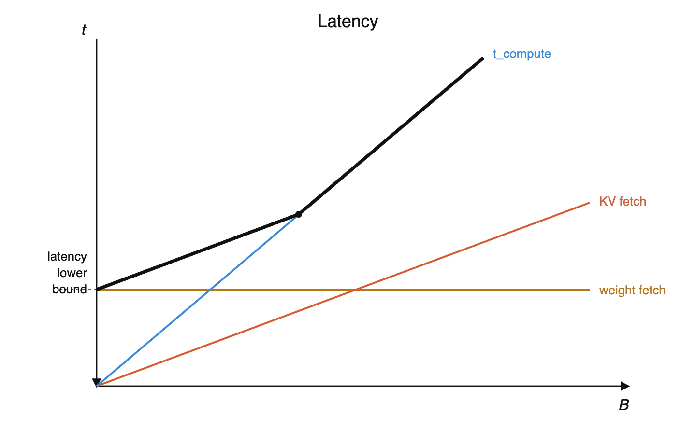
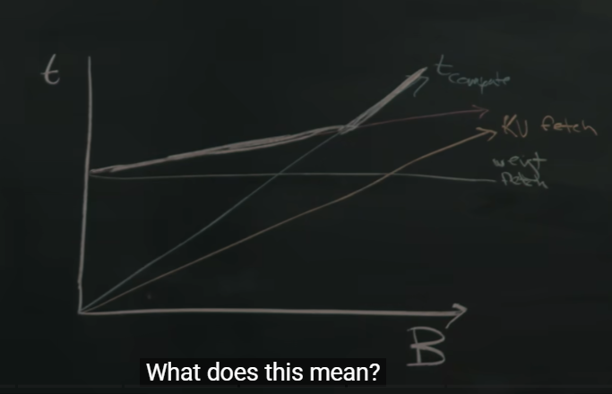
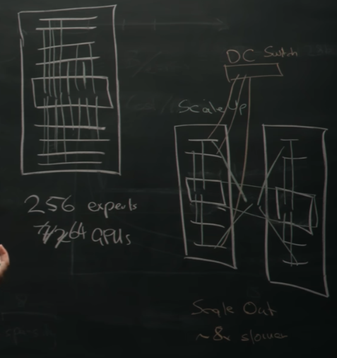
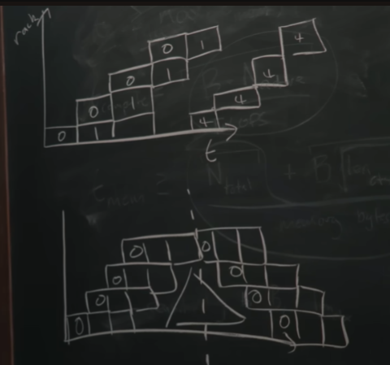
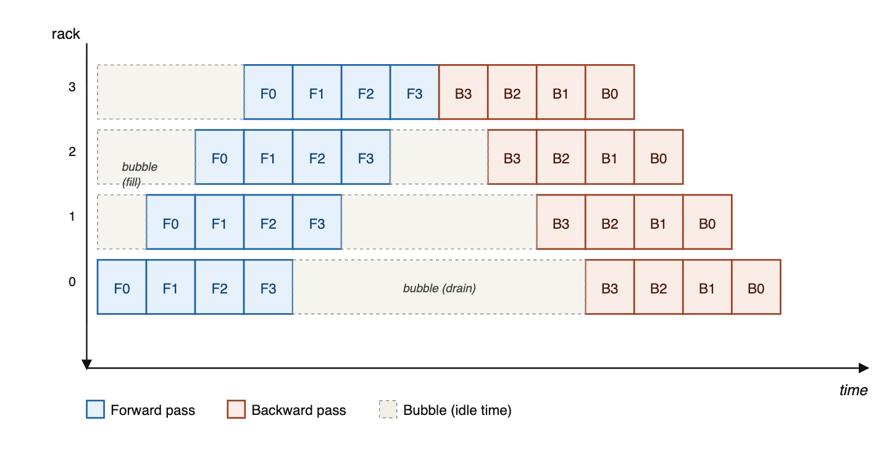

# Reiner Analysis
https://www.dwarkesh.com/p/reiner-pope

The math behind how LLMs are trained and served (Reiner Pope, Apr 2026)

## Timestamps
- (00:00:00) – How batch size affects token cost and speed
- (00:32:09) – How MoE models are laid out across GPU racks
- (00:47:12) – How pipeline parallelism moves model layers across racks
- (01:03:37) – Why Ilya said, “As we now know, pipelining is not wise.”
- (01:18:59) – Because of RL, models may be 100x over-trained beyond Chinchilla-optimal
- (01:33:02) – Deducing long context memory costs from API pricing
- (02:04:02) – Convergent evolution between neural nets and cryptography

## Topics
- Speculative decoding
- Multi-token prediction
- Batch Size

# Roofline analysis of how to run a transformer model on a cluster of chips
Blackwell NVL72 cluster, rack of 72 GPUs

we look at memory bandwidth and compute performance

Look at time to operate on weights, and time to operate on context KV Cache

### From lecture (00:00:00)
The big effect is batch size. There's another effect — speculative decoding or multi-token prediction — come back to that later.

Two principles of analysis:
1. Roofline analysis of how we run a transformer on a cluster of chips (Blackwell NVL72 = rack of 72 GPUs): memory bandwidth and compute performance
2. Two simple factors of the model: time to operate on the weights, and time to operate on the context (KV cache)

If you do not batch together many users, the cost and economics can be a thousand times worse than if you do.

DeepSeek V3: ~37 billion active parameters, ~700 billion total parameters. Focus on just the ones that are active for a single AI token.

## Timing estimate
estimate time t to run inference on a specific shape

```
t >= max(t_memoryfetch, t_compute)
```

this gives us a strong predictive power

```
t_compute = ( B * N_active ) / FLOPS
```

B = batch size

N = number of active parameters

FLOPS = compute throughput

- multiply by all of the active parameters
- do work on the attention

```
t_memoryfetch >= ( N_total + B * len_context * bytes_pertoken ) / memory bytes per second
= weight fetch + KV fetch
```

- sensitivty to batch, len_context

### From lecture
Time must be ≥ a certain quantity. Consider two aspects: time for memory fetches, and time for compute. This gives very strong predictive power even with a simple model.

Compute: multiply by all active parameters, then some work on attention. Batch size × active parameters / FLOPs (chip compute throughput). Accounts for weight matrix multiplies. Ignores attention compute time — generally small in comparison.

Memory: fetch all weights (total parameters, not just active) + KV cache fetch. KV depends on batch: for every element of the batch, fetch an entire context length worth of tokens × bytes per token.

### Flashcards — How batch size affects token cost and speed
**Equation for time of one forward pass (hint — it's the result of two different quantities)**

```
T = max(t_compute, t_mem)
```

**Equation for t_compute — not accounting for attention**

```
t_compute = (B · N_active) / FLOPs
```

where B is batch size, N_active is active parameters, and FLOPs is the compute throughput of the hardware.

**Equation for t_mem (hint — there's a contribution from the weights, and from the KV cache)**

```
t_mem = (N_total + B · len_ctx · KV_bytes/token) / mem_bw
```

## KV Cache / Autoregressive Inference
KV Cache predictive token depending on past tokens = KV Cache

Autoregressive Inference

run each token through





balance point = computer bound and memory bound

- desireable place to be at

### From lecture
During decode: tokens as a tensor in embedding dimension; sequence length in one direction. One step of decode produces one additional token. Full forward pass multiplying by all weight matrices. Attention: this token looks at past tokens' internal representation = KV cache. Single token attending to history is mostly dominated by memory fetches rather than matrix multiplies.

Latency plot (batch size vs time):
- t_compute: purely linear in batch size, no offset
- weight fetch: constant base offset
- KV fetch: linear in batch size
- overall: max of (sum of memory times, compute)

Lower bound on latency: need to read all total parameters from memory into the chips. If I use all my memory bandwidth, I can't do any better than that.

As you vary context length, KV fetch time goes up → transition from compute-limited to memory-limited.

Whenever we have balance points, you're getting it exactly right — equally memory-bound and compute-bound, a really desirable place to be.

Memory fetch modeled as linear in context length — true for dense attention. Sparse attention scales much better (DeepSeek sparse attention papers put a square root in this term).

### Flashcards — Latency vs batch size
**Sketch out (in your head) what the graph with batch size on the x-axis and latency on the y-axis looks like — draw the lines for t_compute, KV fetch, and weight fetch, then bold the line that corresponds to total latency given a certain batch size.**

Latency vs. batch size → see graphs above

**Where does the lower bound on latency come from? Why can't you just keep decreasing batch size and have infinitesimal total time to process a token?**

Because you still have to load all the active parameters into memory.

**Why doesn't the time cost of a token keep decreasing indefinitely as you increase batch size? What two things cannot be amortized over the batch?**

Compute time, and memory time for KV cache fetches, cannot be amortized with batch size.

# Model FLOPS Utilisation (MFU)
Sparse attention (deepseek squaretoot len_context)


```
memory time = compute time
( N_total ) / memory bytes per second = ( B * N_active ) / FLOPS
```

numerator -> model parameters

denominator -> hardware parameters

```
==> FLOPS / memory bandwidth = B * N_active / N_total = 300
```

fp4 = 4 bit floating point

```
==> B >= 300 * sparsity
```

e.g. deepseek activate 32/256 experts hence sparsity = 8, hence B = 2400

in both graphs, the point of change is the same at the same batch size

### From lecture — cost per token
Cost vs batch size = t / B versus batch size (cost per token).
- compute was linear → divide by B → constant
- KV fetch was linear → constant
- weight fetch was constant → divide by B → hyperbola
- max of sum: cost starts very high at batch size 1 (weight fetches not amortized); as batch grows, weight fetches amortized; eventually compute drives cost → limiting lower bound on cost

KV and compute are unique per batch — can't amortize those away. "Slow mode" lives on that lower-bound line; wouldn't help much.

Equate weight fetch time to weight multiply time (disregard KV to simplify):

```
N_total / mem_bw = B · N_active / FLOPs
```

Rearrange: FLOPs / mem_bw = B · N_active / N_total

Make dimensionless via FP4 (half a byte). On most GPUs ≈ 300.

A100 → H100 → B100: FLOPs and memory bandwidth both increased; ratio remained reasonably stable.

```
B ≳ 300 × sparsity
```

DeepSeek: activate 32 of 256 experts → sparsity = 8. Ballpark remarkably accurate; people go a bit larger (maybe 2–3×) because real-world efficiencies aren't as good as roofline.

That's ~2,000–3,000 tokens per batch = ~2,000 unique sequences (one more token each). Including KV cache → optimal batch should grow larger.

### Flashcards — Optimal batch size / FLOPs per byte
**On modern hardware, what is the typical ratio of FLOPs / memory bandwidth?**

∼300 FLOPs / byte.

**Work through the math that shows that optimal batch size ought to be at least 300× your sparsity ratio (active / total parameters) to maximize throughput. Ignore KV cache.**

Set compute time = memory time (at equality, both resources are fully saturated):

```
(B · N_active) / FLOPs = N_total / mem_bw
```

Solve for B:

```
B = (FLOPs / mem_bw) · (N_total / N_active) = 300 · (1 / sparsity)
```

So B ≥ 300 / sparsity.

Why: compute scales with B (each token needs its own matmul), but weight fetches don't (load once, reuse across batch). Need enough tokens to amortize the fetch.

DeepSeek V3: 32/256 active → B ≥ 300×8 = 2,400.

# When does the train depart as a model?
If i keep increasing sparsity what is the model quality impact?

Paper: https://arxiv.org/abs/2202.01169

Unified Scaling Laws for Routed Language Models


Equivalenace between alot of user -> we can go to a sparser model, consumes memory capacity

### From lecture — train schedule / 20ms
Pick a batch size at the intersection (~20ms common). Timeline on GPU: start a new batch every 20ms regardless — schedule for the train. Passengers ready board; if full wait for next; if not full, train goes anyway.

Worst-case queuing: arrive just after departure → wait up to 20ms + wait for that train to complete → worst-case latency ~40ms.

Where 20ms comes from: use all memory capacity (weights or KVs). In a forward pass, want to read all memory capacity into the chip = capacity / bandwidth. Tends to be ~20ms on many HBM generations.

Rubin: 288 GB / 20 TB/s ≈ 15ms.

Why not bigger than 15ms? Means time to read HBM twice — no point reading weight matrices or KVs twice. (Most HBM accesses are reads.)

Tokens/sec ≈ B / time_interval ≈ B × ~60 → ~2,000 × 64 ≈ 128,000 tokens/sec. Gemini announcements ~hundreds of millions tokens/sec worldwide → this is ~1/1000 of that.

Optimal batch depends on sparsity, not (beyond that) on scale.

Sparsity quality: empirical. Paper: Unified Scaling Laws for Routed Language Models. Hold active params fixed, increase expert count → quality keeps increasing. Example: 64-expert 370M activated ≈ as good as dense 1.3B — 64× params for 4× efficiency. From bandwidth analysis it's a pure win (run larger batch) until you run out of users — but also consumes memory capacity.

### Flashcards — Train station analogy
**Picture a GPU cluster as a train station: every ∼20ms, a "train" departs carrying a batch of sequences through one forward pass (producing one new token per sequence). Why 20ms specifically? What goes wrong if you schedule trains more frequently? How about less frequently?**

20ms is the HBM drain time — memory capacity ÷ memory bandwidth. E.g. Rubin: 288 GB / 20 TB/s ≈ 15ms.

Faster than 20ms is impossible because you physically can't read all the weights from HBM in less time than bandwidth allows.

Slower than 20ms means you're just leaving the FLOPs idle, because there's nothing left to read.

# Mixture of Experts
## MultiLayer Perceptron (MLP)
foundational type of deep learning model, a fully connected feedforward neural network that maps raw input data to a specific output


### From lecture — MoE layer
Router decides where tokens route. Tokens → router → experts (small fraction, maybe 1 in 32). Each expert = normal MLP: up projection, nonlinearity, down projection. Inverse: bring back and sum. Residual: token also passed through and added to MoE result.

## Deepseek on Blackwell
Deepseek model: 256 experts

run on a blackwell rack, 72 GPUs

256 experts uses 64 GPUs

4 experts per gpu




### From lecture — expert parallelism
Standard / best: expert parallelism — different experts on different GPUs. DeepSeek 256 experts on Blackwell 72 GPUs → use 64, ignore 8 → 4 experts per GPU.

Traffic: any GPU talking to any other depending on model decisions = all-to-all. Perfect fit for how Blackwell racks are configured. Across two racks: rack-to-rack is a substantial bottleneck. One rack bounds the size of an expert layer → drives larger interconnect domains.

## All to All / Parallelism
All to All: mixture of experts communication connection, full connectivity

data parallelism

pipeline parallelism

```
1 <= t_scaleup / t_scaleout = 1 / 8 (bandwidth) * n_activatedexperts * n_layersperstage * 2 (all to all factor)
```

### From lecture — racks / scale-up vs scale-out
Rack: physical structure, few meters tall, meter or two wide; typically ~64 GPUs/XPUs. Constrained by power, weight, cooling. Data center has thousands of racks.

Nvidia: GPUs outside, NV switches inside. Every GPU ↔ switches → any GPU to any other in two hops (scale-up / NVLink). Leaving the rack: much slower path (~8× slower) via scale-out to data center switch.

MoE across two racks: half tokens stay (fast scale-up), half leave (slow scale-out) → bottleneck. Hierarchy of switches manages cabling congestion.

Hopper 8 → Blackwell 72 = trays to racks (product decision). 64 → ~500 (Rubin): more complicated rack design / more cables. Constraints: space, weight, power, cooling, connector density, bend radius.

Active parameters limited by compute cost; total parameters limited by scale-up size.

### Flashcards — How MoE models are laid out across GPU racks
**Why is one rack a natural boundary for an MoE layer?**

MoE communication is all-to-all (any GPU's tokens may route to any other GPU's experts).

Within a rack, NVLink connects every GPU to every other at full bandwidth, which is a perfect fit for all-to-all. Across racks, scale-out is ∼8× slower and bottlenecks the all-to-all.

## what are all the different dimensions that a model is scaled up?
- layers
- model dimension
- dff dimension (dimension of feed forward network)
- MoE

### From lecture
Every dimension you can cut along if big enough. Selected experts + layers. Model dim / DFF typically not profitable to cut. Tensor parallelism less relevant with smaller experts.

# Microbatching Pipeline parallelism
## Inference
- rack vs time
- forward pass and backward pass



neither better nor worse for altency

means u use less memory capacity for rack, you just need part of the model

use pipelining during inference

but harder trade off in training



### From lecture — when scale-out is OK
All-to-all strongly favors full connectivity within one rack. Data parallelism and pipeline parallelism better fit for multiple racks.

Pipeline: stack MoE layers; change rack between stages. Compare scale-out vs scale-up bandwidth. Explosion: one token → N activated experts (DeepSeek ~16–32), × layers per stage, ×2 for up and down all-to-all. Want t_scaleup / t_scaleout ≥ 1. Need product of activated experts × layers/stage × 2 to beat the 8× bandwidth gap.

Cutting matches the model architecture.

Benefit of pipelining: not runtime (moving memory time rack to rack) — saves memory capacity. Inference: fill bubble immediately (run next microbatch ASAP). Training: hard stop for backward; smaller batch better for ML convergence, worse for systems — trade-off. Zero-bubble / 1F1B schemes exist.

Pipelining neither better nor worse for latency. Less memory capacity per rack (e.g. 1/4 of model). Inference: not used a ton — Blackwell already has huge surplus vs trillion-param model (~1TB). Theoretically could build hardware with less HBM if pipelining assumed.

### The Core Concept: The Assembly Line
To understand both graphs, imagine training an AI model like a car assembly line.

- **The Model:** The car being built.
- **The GPUs (Ranks):** The workstations. GPU 0 builds the chassis, GPU 1 installs the engine, GPU 2 paints it.
- **Micro-batches (The numbers 0, 1, 2, 3):** The individual cars moving down the line.

### Graph 1 (Top): The Forward Pass Pipeline
The top graph shows how we keep all the GPUs busy during the first half of the process (the "forward pass," where data moves through the AI to make a prediction).

**Text Representation:**

```
Time (t) -------------------------------------------------------->

GPU 3:                 [Car 0][Car 1][Car 2][Car 3]
GPU 2:          [Car 0][Car 1][Car 2][Car 3]
GPU 1:   [Car 0][Car 1][Car 2][Car 3]
GPU 0:   [Car 0][Car 1][Car 2][Car 3]
```

**What it is doing:**

- **Without this graph:** GPU 0 would do all its work for a massive batch of data, send it to GPU 1, and then sit idle until the entire process was over. That is highly inefficient.
- **With this graph:** We slice the data into smaller "micro-batches" (Car 0, Car 1, etc.).
- As soon as GPU 0 finishes the chassis for Car 0, it passes it to GPU 1. GPU 0 *immediately* starts building the chassis for Car 1.
- This creates the "staircase" effect you see in the top image. It ensures multiple GPUs are working simultaneously on different pieces of data.

### Graph 2 (Bottom): The Full Cycle and The "Bubble"
Training an AI requires a two-way trip. The data goes forward to make a prediction (Forward Pass), and then the errors travel backward to update the AI's "brain" (Backward Pass). The bottom graph shows this entire cycle.

**Text Representation:**

```
Time (t) ------------------------------------------------------------------------>
                                    (The Pipeline Bubble)
GPU 3:                [ F0 ][ F1 ][ F2 ][ F3 ][ B0 ][ B1 ][ B2 ][ B3 ]
GPU 2:          [ F0 ][ F1 ][ F2 ][ F3 ] <IDLE> [ B0 ][ B1 ][ B2 ][ B3 ]
GPU 1:    [ F0 ][ F1 ][ F2 ][ F3 ] <--- IDLE ---> [ B0 ][ B1 ][ B2 ][ B3 ]
GPU 0:    [ F0 ][ F1 ][ F2 ][ F3 ] <------ IDLE ------> [ B0 ][ B1 ][ B2 ][ B3 ]

Key: [F] = Forward Pass (Building), [B] = Backward Pass (Updating)
```

**What it is doing:**

- **The Upward Stairs (Left side):** This is the exact same forward process from Graph 1. The data moves up from GPU 0 to GPU 3.
- **The Downward Stairs (Right side):** This is the backward pass. GPU 3 calculates the errors, updates its part of the model, and passes the error information *down* to GPU 2, which updates and passes it down to GPU 1, and so on.
- **The Triangle / Bubble (Center):** This is the core problem the graph is illustrating. GPU 0 finishes its forward pass for all micro-batches very early. However, it *cannot* start its backward pass until the error data has traveled all the way from GPU 3 back down the chain.
- Because of this dependency, GPU 0, 1, and 2 are forced to sit idle for a period of time. This idle time forms a triangle shape, widely known in the industry as the **Pipeline Bubble**.

Engineers draw these graphs to figure out mathematical schedules to shrink that center triangle as much as possible, ensuring expensive GPUs spend more time computing and less time waiting.

### Flashcards — How pipeline parallelism moves model layers across racks
**Why do "bubbles" emerge when pipeline parallelism is used during training?**

At the beginning of the batch, the GPUs dedicated to the final layers are not being used, and conversely at the end of the batch, the GPUs dedicated to the first layers are not being used.

Pipeline bubbles diagram → see graph above (`pipeline-bubbles.png`)

**Why can't you overlap batches in training to solve pipeline bubbles?**

You need to consolidate gradients and update the model before you process the next batch.

**Pipeline parallelism across P stages divides model weights by P per device. Why doesn't it also divide the KV cache by P?**

Keeping P stages busy requires P micro-batches in flight, so concurrent sequences scale with P.

Given that KV cache often dominates memory at long context lengths, pipelining's value is limited.

### Flashcards — Why Ilya said, "As we now know, pipelining is not wise."
**Why did Ilya say, "As we now know, pipelining is not wise."**

You're adding architecture constraints — things like Kimi's attention-to-residuals (where each block attends to all previous layers' residuals) become very difficult when those residuals live on different pipeline stages. Similarly, interleaving sliding-window and global attention layers could cause load imbalance across stages. Dealing with all this slows down research iteration, which is the greatest sin you can commit.

# Memory Capacity
```
Cmem = Ntotal + B size ** Context length * * bytes
```

E expert parallelism = 64 (how many GPUs)

P = extent of pipelining (number of racks) 4

```
Per GPU: Cmem = ( Ntotal + B size * Context length * * bytes ) / E P
```

Can't armotise KV cache size across batch size
Can't shard KV cache size across pipeline stages


### From lecture (01:03:37) — capacity, microbatching, why P cancels for KV
Without parallelism: memory demand = N_total (weights) + B × len_ctx × bytes/token (KVs).

Per GPU with E expert parallelism and P pipeline stages:

```
c_mem = (N_total + B · len_ctx · bytes/token) / (E · P)
```

Weights: perfectly divided across GPUs in a rack and layers across racks.

Decode loops the same batch: global batch B = (# micro-batches) × (batch per micro-batch). Micro-batch size ~300 × sparsity (the 20ms train). # micro-batches = # pipeline stages (proof by visual — wrap around with no idle).

Substitute: weights still ÷ (E·P), but for KV the P cancels — more pipeline stages → weight footprint down, activation/KV footprint stays constant. After a little pipelining (even 2), KV dominates.

Can't amortize KV across batch size; also can't shard KV across pipeline stages usefully (more stages ⇒ more sequences in flight — cancels).

Inference practice (DeepSeek): expert parallelism up to scale-up domain size; little/no pipelining. Tensor parallelism not profitable with small experts.

Pipelining solves capacity for model size, not KV / context length. Scale-up size helps bandwidth: t_mem weights = N_total / mem_bw, and mem_bw = (# GPUs in scale-up) × GPU bandwidth — can't use different pipeline stages in parallel for the same load. Hopper→Blackwell scale-up ~8×. Bigger scale-up → lower latency; also more relevant as models get more agentic (longer context).

# Because of RL, models may be 100× over-trained beyond Chinchilla-optimal
### From lecture (01:18:59)
Heuristic: minimize sum of costs → often where costs are equalized (e.g. 1/x + x). Conjecture equalize pretrain / RL / inference costs (~33% each as ballpark).

```
C_pretrain = 6 · N_active · D_pretrain
```

6ND: 2 FLOPs/param/token forward (mul+add); backward ~2× forward (grads w.r.t. both input matrices) → 2+4=6.

```
C_RL ≈ (2 to 6) · N_active · D_RL · inefficiency
```

2 if forward-only on rollouts; up to 6 if train on them. Decode often lower MFU than training.

```
C_inference = 2 · N_active · D_inference · inefficiency
```

N_active cancels. Roughly D_pretrain ≈ D_RL ≈ D_inference within factors we can't reason about tightly; fewer RL tokens than pretrain if equalizing wall time (RL less efficient).

Inference tokens: ~50M tokens/sec × 2 months ≈ ~200T tokens → D_pretrain ≈ 200T. Active ~100B → Chinchilla D ≈ 20 × 100B = 2T → ~100× over Chinchilla-optimal.

### Flashcards
**Where does the 6 in the 6ND pre-training FLOPs equation come from?**

2 FLOPs per parameter per token for the forward pass (multiply + add). Backward pass is 2× forward because you compute gradients w.r.t. both input matrices. So 2 + 4 = 6.

**Write the equation for total compute cost across pre-training, RL, and inference.**

```
C_total = C_pretrain + C_RL + C_inference
```

```
C_pretrain = 6 × N_active × D_pretrain
```

(the 6ND formula — forward + backward)

```
C_RL = (2 to 6) × N_active × D_RL × inefficiency
```

(2 if you don't train on the rollout and do forward only, up to 6 if you do; inefficiency from low MFU during decode)

```
C_inference = 2 × N_active × D_inference × inefficiency
```

(forward pass only; lower MFU during decode)

**Why might you naively expect C_pretrain = C_RL = C_inference?**

If pre-training, RL, and inference costs trade off (more pre-training → less RL/inference needed for same quality, and vice versa), the optimum is approximately where all three are equal.

**Solve for D_pretrain = D_RL = D_inference, with 1/3 as much MFU from decode as prefill.**

```
6 × D_pretrain = 3 × D_RL × 3 × inefficiency = 2 × D_inference × 3 × inefficiency
```

```
D_pretrain = 1.5 D_RL = D_inference
```

**If a frontier model does 50M tokens/sec globally and is deployed for 2 months, using the analysis above, how many tokens should it be pretrained on?**

```
D_inference ≈ 50M tokens/sec × 60 days × 86,400 sec/day ≈ 200T tokens
```

```
D_pretrain ≈ D_inference ≈ 200T tokens
```

**The Chinchilla rule is that D_optimal ≈ 20 × N_active. If a frontier model has 100B active parameters and is pretrained on 200T tokens, how much over Chinchilla-optimal is it?**

```
D_chinchilla ≈ 20 × 100B = 2T tokens
```

```
200T / 2T = 100×
```

# Deducing inference memory costs from API pricing
### From lecture (01:33:02)
Gemini ~50% more expensive over 200k context. Cost vs context length: compute ~constant in context; memory starts at weight cost then grows with context → inflection / crossover. Two-tier pricing aligned near that crossover so always profitable.

At crossover (assume large B so weight mem negligible): t_compute = t_KV → bytes/token ≈ (1/300) · N_active / len_ctx. With N_active ≈ 100B, len=200k → ~1.7 KB/token. Plausible via dense attn (e.g. 8 KV heads × d_head 128, or share KV across layers as Character AI / Gemma) or sparse with 1/sparsity.

Output 3–5× input: prefill compute-limited, decode memory-bandwidth-limited. Prefill: longer pass amortizes weight fetch across many tokens (t/len_pass); decode: load all weights for one token.

Cache hits ~10× cheaper: rematerialize KV from token IDs (recompute) vs load stored KVs. Memory tiers: HBM / DDR / flash / disk — cost to hold vs cost to retrieve; drain time of tier ≈ hold duration (HBM ~20ms; API 5min vs 1hr may map to flash vs spinning disk).

Context lengths jumped ~8k → 100–200k then hovered — balanced cost point; memory bandwidth wall. Sparse attention helps (√) but not infinite (quality).

### Flashcards
**Why does Gemini charge ~50% more for tokens above 200K context? At a high level, what's happening?**

Below this point, you're compute bound, where marginal cost per token is flat as context length increases.

Above this point, you're memory time bound, thanks to KV cache growing, and so marginal token cost increases linearly with context length.

**Sketch compute and memory time per token as context length increases. Then also sketch the pricing per token and how it changes at the crossover point.**

Cost vs. context length

**Given Gemini's 200K crossover, work out the implied bytes-per-token of KV cache. Assume 100B active parameters.**

At the crossover, t_compute = t_KV fetch:

```
(B · N_active) / FLOPs = (B · len_ctx · bytes/token) / mem_bw
```

Solve for bytes/token:

```
bytes/token = (mem_bw / FLOPs) · (N_active / len_ctx) = (1/300) · (N_active / len_ctx)
```

Plug in: N_active ≈ 100B, len_ctx = 200K → bytes/token ≈ 1.7 KB.

**Output tokens are typically 3–5× more expensive than input tokens. What does that tell us? And why is that?**

MFU during decode is about 1/5 that during prefill.

This is because in prefill, you're processing the whole sequence in parallel, so the weight fetch can be amortized across lots of compute, whereas in decode, you have to load all the weights in just to process one more token, which means you're wasting FLOPs while you're waiting for the weights to show up from memory.

**Why are cached input tokens (cache hits) ∼10× cheaper than fresh input tokens?**

Loading KVs from memory is much cheaper than recomputing.

# Convergent evolution between neural nets and cryptography
### From lecture (02:04:02)
Blog: https://reiner.org/neural-net-ciphers

Both jumble information across inputs — crypto so each input bit scrambles the hash; NNs so pieces of info affect each other. Opposite ends: crypto takes structured → looks random; NNs take seemingly random → extract structure.

Randomly init NN might be a reasonable cipher; gradient descent makes NNs interpretable (residuals, LayerNorm keep derivatives simple). Differential cryptanalysis differentiates ciphers (over GF(2)); goal is large output difference from small input difference — opposite of what NNs want. Adversarial attacks on classifiers = avalanche property (undesired in nets, desired in ciphers).

Feistel network: build invertible function from non-invertible f. Ported to NNs as RevNets (2017) — invertible transformer-like nets; rematerialize activations on backward instead of storing → memory saving (spend compute to save memory). Opposite of KV cache (spend memory to save compute) — spending memory to save compute generally profitable on current hardware.

### Flashcards
**Why do cryptographic protocols have similar high-level architecture to neural networks, where they're basically jumbling information across many layers?**

They've both had this convergent evolution where cryptographic protocols need every output bit to depend on every input bit in complicated ways, and similarly, NNs need output to make connections between inputs.

**One could argue that NNs and cryptographic protocols use a similar high-level architecture to opposite ends. In what sense are they doing opposite things?**

Cryptographic protocols take something which has a lot of structure and make it seem indistinguishable from random. Whereas NNs take something which may look random and extract structure from it.

---

# Roofline drills (cover → check)

Decode time = time for **one forward** that emits **one new token per sequence** in the batch.

## What to practice
Until you can do it without notes:

1. Write the bound
   ```
   t ≥ max(t_compute, t_mem)
   t_compute = (B · N_active) / FLOPs
   t_mem     = (N_total · bytes/param + B · len_ctx · KV_bytes/token) / mem_bw
   ```
2. Split memory — weight fetch (flat in `B`) vs KV fetch (grows with `B` and context)
3. Say which wins — mem-bound, compute-bound, or near balance
4. Vary levers — ↑`B`, ↑context, speculative decode / MTP (more tokens per weight load → lower effective cost/token; latency floor still ≈ weight drain)

## Spec sheet (round freely)

| Hardware | FLOPs (use) | HBM BW | Notes |
|---|---|---|---|
| 1× H100 | 2e15 /s (FP8) | 3.35e12 B/s | ~80 GB |
| 8× H100 | 16e15 /s | 26.8e12 B/s | one Hopper “box” |
| 1× B200-ish | 9e15 /s (FP4-ish) | 8e12 B/s | ballpark |
| 72× Blackwell (NVL72) | 72 × one-GPU | 72 × one-GPU | full rack scale-up |
| Rubin (lecture) | — | 20e12 B/s, 288 GB | drain ≈ 15 ms |

- Weight bytes: FP4 = 0.5 B/param, FP8 = 1, BF16 = 2
- KV: ~1–2 KB/token (lecture ~1.7 KB from Gemini 200k)
- Dense: `N_active = N_total`. MoE sparsity = `N_total / N_active`

## How to practice (10–15 min loop)
Cover the numbers below, then for each drill write:

1. `t_compute`, weight, KV
2. `t = max(...)`
3. Bound type
4. What happens if you 2× `B` / 2× context / 2× sparsity

Order: Drills 1 → 2 → 4 first; 3 once comfortable. Drill 5 anytime.

---

## Problems (cover this section)

### Drill 1 — small dense, 1× H100
**Model:** 7B dense, FP8 (`N = 7e9`), `len_ctx = 4k`, KV = 1 KB/tok, `B = 1`  
**HW:** 1× H100

Find `t_compute`, weight, KV, `t_mem`, `t`, and bound type.

### Drill 2 — same model, bigger batch
Same 7B FP8 on 1× H100, `len_ctx = 4k`, KV = 1 KB/tok.

1. `B = 512` — find times + bound
2. `B = 2048` — find times + bound
3. **Ask:** at what `B` does `t_compute ≈ weight` (ignore KV)?

### Drill 3 — DeepSeek-shaped MoE on a rack
**Model:** `N_total = 700e9`, `N_active = 37e9`, FP4 (0.5 B/param)  
**HW:** 64 GPUs of a Blackwell rack, each ~9e15 FLOPs, ~8e12 B/s  
→ `FLOPs = 576e15`, `mem_bw = 512e12 B/s`  
`B = 2400`, `len_ctx = 8k`, KV = 1.7 KB/tok

Find times + bound. Also: optimal `B` ignoring KV (`B ≳ 300 · N_total/N_active`). Compare to notes’ 32/256 → sparsity 8 → `B ≳ 2400`.

### Drill 4 — long context → KV-bound
**Model:** 70B dense FP8  
**HW:** 8× H100 (`FLOPs = 16e15`, `mem_bw = 26.8e12`)  
KV = 1.7 KB/tok

1. `B = 64`, `len_ctx = 4k`
2. `B = 64`, `len_ctx = 200k`
3. `B = 512`, `len_ctx = 200k`

For each: times + bound. What does this say about Gemini’s +200k price kink?

### Drill 5 — HBM drain / “train” time
Rubin: 288 GB HBM, 20 TB/s BW.

1. Drain time?
2. If trains depart every ~20 ms, worst-case latency if you just miss a train?

---

## Solutions

### Drill 1
```
t_compute = (1 · 7e9) / 2e15 = 3.5e-6 s ≈ 0.0035 ms
weight    = 7e9 · 1 / 3.35e12 ≈ 2.1 ms
KV        = 1 · 4000 · 1000 / 3.35e12 ≈ 0.001 ms
t_mem     ≈ 2.1 ms
t         ≈ max(0.0035, 2.1) ≈ 2.1 ms  → weight-mem bound
```

### Drill 2
**B = 512**
```
t_compute = 512 · 7e9 / 2e15 ≈ 1.8 ms
weight    ≈ 2.1 ms  (unchanged)
KV        = 512 · 4000 · 1000 / 3.35e12 ≈ 0.61 ms
t_mem     ≈ 2.7 ms
t         ≈ max(1.8, 2.7) ≈ 2.7 ms  → still slightly mem (weight+KV)
```

**B = 2048**
```
t_compute = 2048 · 7e9 / 2e15 ≈ 7.2 ms
KV        = 2048 · 4000 · 1000 / 3.35e12 ≈ 2.4 ms
t_mem     ≈ 2.1 + 2.4 = 4.5 ms
t         ≈ max(7.2, 4.5) ≈ 7.2 ms  → compute bound
```

**Balance B (ignore KV)**
```
B ≈ (FLOPs / mem_bw) · (bytes/param) ≈ (2e15 / 3.35e12) · 1 ≈ 600
```
Order-of-magnitude; lecture’s ~300 is the FP4-normalized constant.

### Drill 3
```
t_compute = 2400 · 37e9 / 576e15 ≈ 0.15 ms
weight    = 700e9 · 0.5 / 512e12 ≈ 0.68 ms
KV        = 2400 · 8000 · 1700 / 512e12 ≈ 0.064 ms
t_mem     ≈ 0.75 ms
t         ≈ max(0.15, 0.75) ≈ 0.75 ms  → weight-mem bound
```

Optimal B (ignore KV):
```
B ≳ 300 · (N_total / N_active) ≈ 300 · (700/37) ≈ 300 · 19 ≈ 5700
```
Notes’ expert sparsity 32/256 → factor 8 → `B ≳ 300 · 8 = 2400`.

### Drill 4
**B = 64, len = 4k**
```
t_compute = 64 · 70e9 / 16e15 ≈ 0.28 ms
weight    = 70e9 · 1 / 26.8e12 ≈ 2.6 ms
KV        = 64 · 4000 · 1700 / 26.8e12 ≈ 0.016 ms
t         ≈ 2.6 ms  → weight bound
```

**B = 64, len = 200k**
```
KV        = 64 · 200000 · 1700 / 26.8e12 ≈ 0.81 ms
t_mem     ≈ 2.6 + 0.81 = 3.4 ms
t_compute ≈ 0.28 ms
t         ≈ 3.4 ms  → still weight-ish, but KV growing
```

**B = 512, len = 200k**
```
t_compute = 512 · 70e9 / 16e15 ≈ 2.2 ms
weight    ≈ 2.6 ms
KV        = 512 · 200000 · 1700 / 26.8e12 ≈ 6.5 ms
t_mem     ≈ 9.1 ms
t         ≈ 9.1 ms  → KV-dominated mem bound
```

Gemini intuition: past enough context, **KV** sets the floor → price kink.

### Drill 5
```
drain = 288e9 / 20e12 ≈ 14 ms  → trains every ~15–20 ms
worst-case latency ≈ wait + ride ≈ 20 + 20 ≈ 40 ms if you just miss a train
```
