# Agent Harness Engineering & Architecture Notes

Comprehensive technical reference on AI coding agent harnesses, the driver loop execution model, server-side prompt caching mechanics, tool-calling evolution (V1 text parsing vs. V2 native schemas), harness modes, and skills/MCP orchestration pipelines.

---

## 1. The Fundamental Agent Equation & The Driver Loop

$$\text{Agent} = \text{Model} + \text{Harness}$$

Modern coding assistants (Claude Code, Cursor Composer, Google Antigravity, Aider) are not raw Large Language Models. An LLM in isolation is a stateless, next-token predictor that only operates on text tokens (**"text in, text out"**). It has no autonomous agency, cannot read files, cannot execute bash commands, and cannot interact with the operating system on its own.

```mermaid
flowchart LR
    subgraph Model["1. Raw Model (The Brain)"]
        direction TB
        LLM["Foundation LLM<br/>(Claude 3.7 / Sonnet, GPT-4o, Gemini)"]
        Weights["Next-Token Predictor<br/>(Stochastic / Black-Box)"]
    end

    subgraph Harness["2. Agent Harness (The Operating System / Driver)"]
        direction TB
        Driver["Deterministic Driver Loop<br/>(While True Execution Engine)"]
        ContextMgr["Context & Memory Manager<br/>(Prefix Cache, RAG, Transcript)"]
        ToolEngine["Tool Execution Engine<br/>(Terminal, Filesystem, MCP, Subagents)"]
        Sanitizer["Context Sanitizer & Filter<br/>(HTML Stripping, AST Indexes)"]
        Guardrails["Security & Sandboxing<br/>(Whitelists, Mode Permissions)"]
    end

    subgraph Environment["3. Physical Environment"]
        FS["Filesystem & Codebase"]
        Terminal["Bash / PowerShell Shell"]
        LSP["Language Server / Compilers"]
        RemoteAPI["Cloud APIs / MCP Servers / Web"]
    end

    Model <--> Harness
    Harness <--> Environment
```

### The Driver Program (The Minimal Agent Loop)

The core of every harness is a deterministic **Driver Program** running an execution loop outside the model:

```python
def run_agent_driver(user_prompt: str, tools: list, system_prompt: str):
    context = [
        {"role": "system", "content": system_prompt},
        {"role": "user", "content": user_prompt}
    ]
    
    while True:
        # 1. Model inference (text in -> text/tool_call out)
        response = llm.generate(context=context, tools=tools)
        
        # 2. Check if the model requested an external action
        if response.has_tool_calls():
            for tool_call in response.tool_calls:
                # 3. Deterministic execution OUTSIDE the LLM
                tool_result = execute_local_tool(
                    name=tool_call.name, 
                    args=tool_call.args
                )
                # 4. Append tool execution output back into context
                context.append({
                    "role": "tool",
                    "tool_call_id": tool_call.id,
                    "content": tool_result
                })
            # Loop continues: LLM evaluates tool results in next turn
        else:
            # Final text response reached; return to user
            return response.text
```

> [!NOTE]
> **The Engineering Reality**: The only stochastic or "mysterious" component of an agent is the probability distribution inside the LLM weights. Everything outside the model—the driver loop, state machines, tool routers, context sanitizers, and security sandboxes—is **100% deterministic, classical software engineering** ("glue code").

---

## 2. Tool-Calling Evolution in Harnesses: V1 vs. V2

How does a text-only LLM trigger real-world actions? Harness engineering evolved from naive text parsing to post-trained native tool-calling protocols.

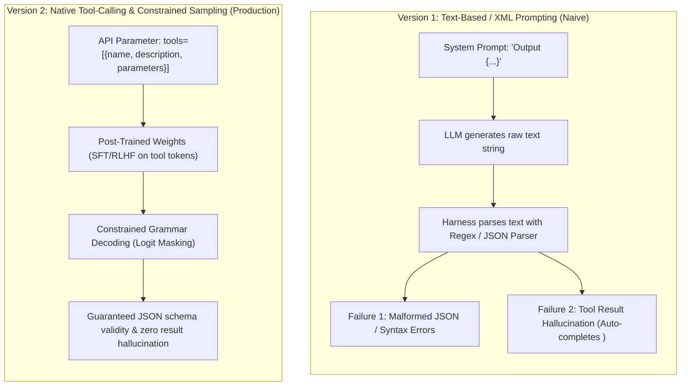

### Version 1: Text-Based / XML Parsing (Naive Prompt-Engineering)
* **Mechanism**: Instruct the LLM via system prompt to wrap actions in custom tags:
  ```xml
  <tool_call>{"name": "web_search", "args": {"query": "JAX pallas documentation"}}</tool_call>
  ```
* **Critical Failure Modes**:
  1. **Tool Result Hallucination**: Because LLMs are trained as sequence auto-completers, the model often generates its own fake `<tool_result>` immediately after `<tool_call>` without yielding execution back to the driver:
     ```xml
     <tool_call>{"name": "read_file", "args": {"path": "main.py"}}</tool_call>
     <tool_result>def main(): print("Fake file contents generated by LLM")</tool_result>
     ```
  2. **Syntax Fragility**: Unconstrained text generation frequently drops quotes, generates trailing commas, or introduces invalid escape sequences that break JSON deserializers.

### Version 2: Native Tool Calling (Structured API Schemas)
* **Mechanism**: Tool signatures are provided as structured JSON schemas via dedicated API parameters (`tools=[...]`).
* **Why It Works**:
  1. **Post-Training Alignment**: Frontier models are specifically fine-tuned on special tool-call tokens (`<|start_header_id|>tool_call`, `<tool_use>`, etc.).
  2. **Constrained Grammar Sampling**: During the decoding phase, the inference engine applies logit masking to enforce valid JSON syntax corresponding to the tool parameter schema at the token generation level.

---

## 3. Minimal Tool Primitives & Context Sanitization

An autonomous coding harness requires only a minimal set of foundational tool primitives to execute arbitrary workflows, but must rigorously sanitize context to prevent prompt bloat.

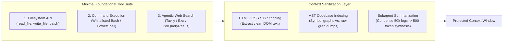

### 1. Minimal Tool Primitives
* **Filesystem Operations**: `view_file` (with line slicing/offsets), `write_file`, `replace_file_content` (precise AST or chunk diffs).
* **Terminal Execution**: Whitelisted command execution (`pytest`, `python3`, `git`, `grep`, `curl`, `head`, `tail`) with timeouts and background task managers.
* **Agentic Search**: Specialized search endpoints (e.g., Tavily, Exa) that return structured markdown text rather than raw HTML search engine results.

### 2. Context Sanitization & Bloat Prevention
If an agent executes `curl https://example.com` or reads an entire minified bundle, the raw response floods the context window with tens of thousands of tokens of useless CSS/JS/boilerplate.
* **DOM Filtering**: Strip `<script>`, `<style>`, `<nav>`, and minified attributes before context injection.
* **Subagent Delegation**: Delegate long-running research or raw page reading to a temporary subagent, returning only a condensed synthesis to the primary driver context.
* **AST Indexing vs. Brute Grep**: Providing symbols, function definitions, and dependency trees via Language Server Protocol (LSP) instead of dumping hundreds of raw file lines.

---

## 4. Server-Side Prompt Caching (KV Cache) in Harnesses

A common misconception is that IDE harnesses cache API responses locally on the developer's laptop. In reality, **prompt caching is handled remotely inside the LLM provider's GPU cluster**.

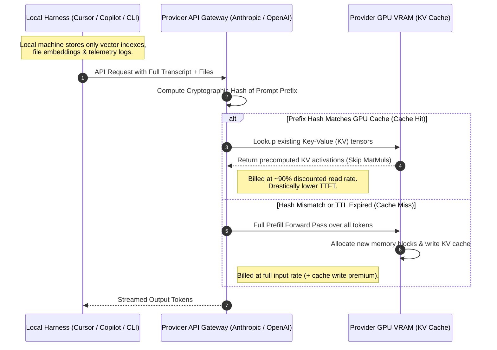

### Where Data Lives: Local Storage vs. Remote Cache

| Layer | Location | What Is Stored There | Persistence / Lifetime |
| :--- | :--- | :--- | :--- |
| **Active Prompt / KV Cache** | **Provider Server GPU VRAM** | Precomputed Key ($K$) and Value ($V$) attention tensors for the prompt prefix. | Ephemeral sliding **Time-To-Live (TTL)** (5 min – 30+ min). |
| **Codebase Index & RAG** | **Local Developer OS** | Vector embeddings, SQLite databases, AST symbols, codebase index caches. | Persistent until workspace files change or index is rebuilt. |
| **Agent State & History** | **Local Harness App Memory** | JSON conversation transcripts, scratchpads, tool execution outputs. | Persisted per chat session / conversation ID. |

---

## 5. How Providers Track Caches: Prefix Hashing & TTL Mechanics

LLM providers do **not** index caches by client Session IDs. Because API endpoints are inherently stateless, the remote cache is matched using **Exact Cryptographic Prefix Hashing**.

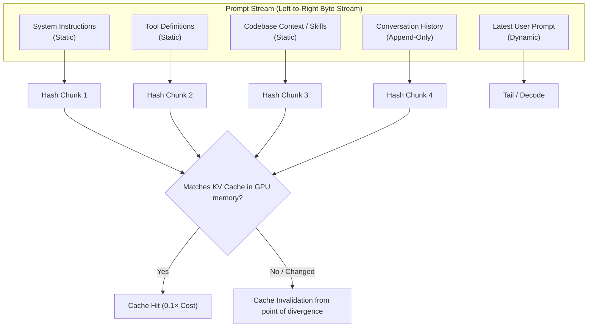

### 1. Cryptographic Prefix Hashing
* The backend reads the token stream strictly from left to right.
* If the first $N$ tokens match the pre-existing hash chain in GPU memory, the inference engine reuses the KV cache up to token $N$.
* **The Fragility Rule**: If a single character, token, or dynamic timestamp changes at the beginning of the prompt, **the entire hash breaks**, invalidating the cache for everything that follows.

### 2. Time-To-Live (TTL) Eviction Mechanics
Remote GPU VRAM is an expensive, constrained resource. Providers do not retain KV caches indefinitely; they use countdown timers and memory eviction policies:
1. **Cache Write / Prefill**: When an eligible prefix arrives, the backend computes the $K$ and $V$ matrices, commits them to GPU VRAM (or a multi-tier cache), and arms a **sliding TTL timer**.
2. **Cache Read (Hit)**: If a subsequent request arrives with the identical cryptographic prefix before the timer expires, the server bypasses the matrix multiplications, charges a heavily discounted cached read rate, and **resets the sliding TTL timer back to full**.
3. **Cache Inactivity Eviction**: If no request touches the prefix within the TTL window, the server evicts the tensors and reclaims the GPU memory blocks. Subsequent requests with that prefix suffer a **Cache Miss**, requiring a 100% full re-computation (and potentially a cache write surcharge).

### Comprehensive Multi-Provider Prompt Caching & TTL Matrix

| Provider / Ecosystem | Mechanism Type | Inactivity TTL (Lifetime) | Min. Tokens to Cache | Cache Write Pricing | Cache Read (Hit) Pricing | Cache Eviction & Routing Mechanics |
| :--- | :--- | :--- | :--- | :--- | :--- | :--- |
| **Anthropic** *(Claude 3.5 / 3.7 Sonnet, Opus, Haiku)* | **Explicit** (via `cache_control: {"type": "ephemeral"}`) | **5 minutes** (sliding); optional **1-hour** extended tier | $1{,}024$ tokens ($2{,}048$ for Haiku) | **$+25\%$ premium** ($1.25\times$ base) for 5-min TTL; $\sim 2.0\times$ for 1-hr TTL | **$90\%$ discount** ($0.10\times$ base price) | Up to 4 explicit cache breakpoints per request. Strict sliding TTL (resets on hit). Hard eviction after 5 min of inactivity. |
| **OpenAI** *(GPT-4o, GPT-4o mini, o1, o3-mini)* | **Automatic** (Prefix matching) | **5–10 minutes** in-memory (can extend to 1 hr; up to 24 hrs off-peak) | $1{,}024$ tokens (increments of 128 tokens) | **$1.0\times$ base** (No write surcharge on standard API) | **$50\% - 80\%$ discount** ($0.50\times - 0.20\times$ base depending on model) | Automatic prefix matching from token 0. Optional `prompt_cache_key` routes requests to the same GPU cluster node. Evicted under high cluster load. |
| **Google Gemini (Implicit)** *(Gemini 2.0 Flash / Pro, 2.5)* | **Automatic / Implicit** | System-managed (opportunistic) | Model-dependent ($\sim 1{,}024$ tokens) | **$1.0\times$ base** (Zero write fee) | **$\approx 75\% - 90\%$ discount** | Best-effort server caching. No storage fees, but no strict persistence guarantee. |
| **Google Gemini (Explicit)** *(Gemini 1.5 Pro/Flash, 3.7 Flash)* | **Explicit** (`CachedContent` API) | **User-defined** (Default: **1 hour**; configurable to days) | $32{,}768$ tokens (Pro) / $1{,}024$ (Flash) | **$1.0\times$ base** input (No write premium) | **$75\% - 90\%$ discount** on input tokens | **Continuous Storage Fee**: Billed per 1M tokens/hour (e.g. $\$0.50 - \$1.00/\text{M}/\text{hr}$ for Gemini 3.7 Flash prorated by the minute) until TTL expires or deleted. |
| **DeepSeek** *(DeepSeek-V3, DeepSeek-R1)* | **Automatic** (Multi-tier Disk + RAM) | Opportunistic / System-managed | $64$ tokens | **$1.0\times$ base** (Zero write surcharge) | **$\approx 90\%$ discount** ($\$0.014/\text{M}$ cached vs $\$0.14/\text{M}$ uncached on V3) | Automatic prefix caching stored across high-speed NVMe and GPU memory tiers. Auto-evicted on cluster memory pressure. |
| **AWS Bedrock** *(Claude, Amazon Titan)* | **Explicit** (`cachePoint` markers) | **5 minutes** default (sliding); **1-hour** option for Claude | $1{,}024$ tokens | **$+25\%$ write premium** ($1.25\times$ base input) | **Up to $90\%$ discount** ($0.10\times$ base) | Supports explicit checkpoint blocks in conversational and agent APIs. |
| **Mistral AI** *(Mistral Large, Codestral)* | **Explicit** (Session keying) | Managed session window | Model-dependent | **$1.0\times$ base** | Discounted cached rates | Uses `prompt_cache_key` parameter to bind conversation state to local worker caches. |
| **Open-Source / Self-Hosted** *(vLLM, SGLang, TensorRT-LLM)* | **RadixAttention / Paged Prefix Caching** | **LRU Capacity-Bound** (No time-based TTL) | Configurable block size (16–64 tokens) | Internal GPU computation cost | **Zero FLOP prefill** for cached prefix | Manages cached KV blocks as a **Radix Tree** in GPU VRAM / host RAM. Eviction is driven by **Least Recently Used (LRU)** memory pressure when VRAM fills up, rather than a clock timer. |

---

## 6. The Cost Dynamics of Model Switching & The "Coffee Break" Penalty

### A. The Model Switching Overhead

Prompt caches are strictly model-specific. The attention weights and dimensional shapes of Claude 3.5 Sonnet cannot be evaluated against a KV cache generated by GPT-4o.

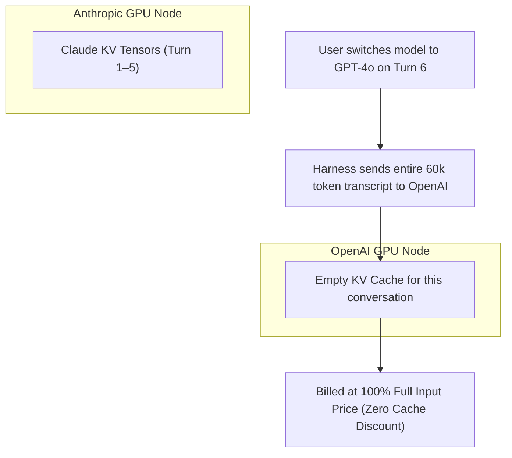

#### Cost Progression During a Mid-Chat Model Switch

| Turn | Active Model | Token Payload | Pricing Category | Effective Cost Multiplier |
| :--- | :--- | :--- | :--- | :--- |
| **Turn 1** | Claude 3.5 Sonnet | System + Initial Codebase Context (50k) | Cache Write | **$1.25\times$** (Full price + write premium) |
| **Turns 2–5** | Claude 3.5 Sonnet | Cumulative transcript (50k $\to$ 75k) | Cache Read | **$0.10\times$** (90% discount on cached prefix) |
| **Turn 6 (Switch)** | **GPT-4o** | Full 75k history re-sent | **Cache Miss (Fresh Ingest)** | **$1.00\times$** (100% Full price input on 75k tokens) |
| **Turns 7+** | GPT-4o | Cumulative GPT-4o transcript | Cache Read | **$0.50\times - 0.10\times$** (OpenAI cache discount) |

### B. The "Coffee Break" Penalty & The Agent Token Snowball

In multi-step autonomous agent runs, the agent executes shell commands, reads files, and writes diffs. Each step appends tool calls and tool outputs to the transcript:

$$\text{Total Transcript Tokens} = \text{System Prompt} + \sum_{i=1}^T (\text{User}_i + \text{Thought}_i + \text{ToolCall}_i + \text{ToolResult}_i)$$

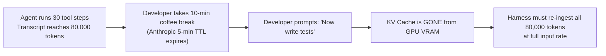

> [!WARNING]
> **Token Snowball Rule**: If an agent generates an 80,000-token transcript and you step away for 10 minutes using a model with a 5-minute TTL (like Claude), your very next 5-word message will trigger a full **80,000-token un-cached ingestion bill**.

#### Mitigation Strategies:
1. **Thread Partitioning**: Once an agent accomplishes a self-contained task, start a fresh chat/composer thread rather than continuing an 80k-token session.
2. **Strategic Model Selection**: If you anticipate frequent pauses or asynchronous reviews, models with longer TTLs (e.g., OpenAI's 30-minute window) avoid frequent cache eviction penalties.

---

## 7. Harness Modes: Ask Mode vs. Plan Mode vs. Agent Mode Architecture

Harnesses partition developer workflows into distinct operational modes to balance computation cost, latency, system safety, and tool execution boundaries.

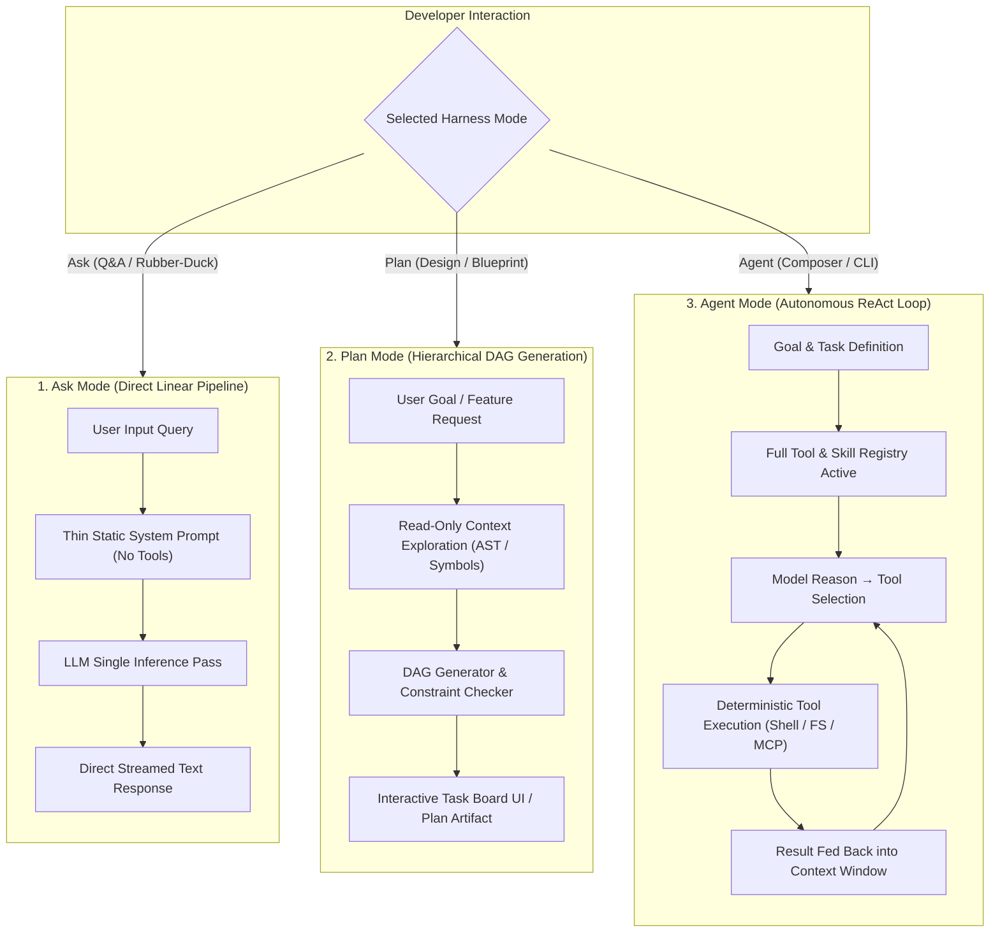

### System Architectural Matrix: Ask vs. Plan vs. Agent

| Architectural Element | Ask Mode | Plan Mode | Agent Mode |
| :--- | :--- | :--- | :--- |
| **Control Loop Style** | **Linear** (Direct single-pass pipeline) | **Hierarchical** (Graph blueprinting / DAG) | **Cyclical** (ReAct engine execution loop) |
| **Tool Registry State** | **Purged & Locked** (Zero function-calling tokens) | **Read-Only Verification** (`view_file`, `list_dir`, grep) | **Read & Write Executable** (Terminal, edits, subagents, MCP) |
| **Primary System Metric** | **Time-to-First-Token (TTFT)** & Streaming Speed | **Structural Accuracy** & Dependency Validation | **Autonomous Goal Resolution Rate** |
| **Token Cost Profile** | **Minimal** (Single forward pass, no loop overhead) | **Moderate** (Blueprint evaluation pass) | **High** (Iterative multi-turn history accumulation) |
| **Skill Registry State** | **Bypassed** (No skill discovery/loading parser) | **Structural Checker** (Architecture compliance) | **Dynamic On-Demand** (Progressive disclosure) |

### Core Architectural Pipelines

1. **Ask Mode: Low-Latency Streaming Pipeline**
   ```
   [User Input] ──> [Lightweight System Persona] ──> [LLM Inference] ──> [Streamed Output]
   ```
   * **Context Purging**: The harness purges tool schemas from the system prompt. This eliminates function-calling tokens, preventing the model from accidentally generating tool calls and maximizing streaming speed.
   * **Stateless Stream**: Treats each query simply as text context, with no background execution middleware.

2. **Plan Mode: Directed Acyclic Graph (DAG) Engineering**
   ```
   [User Goal] ──> [Read-Only Inspection] ──> [DAG Generator Engine] ──> [Constraint Check] ──> [Task Board UI]
   ```
   * **Architectural Blueprinting**: System prompts force the model to decompose goals into ordered, dependency-checked steps before writing code.
   * **Read-Only Sandbox**: Inspects file paths and symbols without modifying filesystem state.

3. **Agent Mode: Autonomous Runtime Loop**
   ```
   [Goal] ──> [System Prompt + Full Tool/Skill Registry] ──> [LLM Reason] ──> [Call Tool/Skill] ──> [Evaluate Result] ──> [Repeat/Finish]
   ```
   * **ReAct Engine (Reason + Act)**: The harness runs an external `while True` loop, dynamically loading skills, executing bash commands, applying diffs, and self-correcting on compiler errors.

---

## 8. IDE vs. CLI Harness Architecture Paradigms

Different developer harnesses adopt fundamentally different architectural philosophies regarding file systems, tool execution, and context delivery.

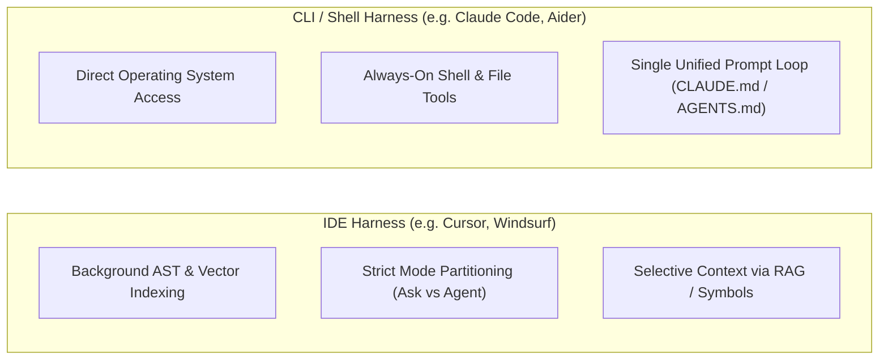

### Comparative Architecture Breakdown

```
+-----------------------------------------------------------------------------------+
|                                 HARNESS TAXONOMY                                  |
+------------------------------------+----------------------------------------------+
| IDE Harnesses (Cursor, Windsurf)   | Terminal / CLI Harnesses (Claude Code, Aider)|
+------------------------------------+----------------------------------------------+
| * Heavy background vector index    | * Direct shell / filesystem environment      |
| * Strict boundary between chat &   | * Fluid boundary (single interactive session |
|   agent execution                  |   handles queries, edits, and terminal runs) |
| * Context delivered via RAG chunks | * Context explored live via grep/view tools  |
| * Custom rules in .cursorrules or  | * Universal rules in CLAUDE.md or AGENTS.md  |
|   settings UI                      |   injected directly into system prompt       |
+------------------------------------+----------------------------------------------+
```

---

## 9. How Harnesses Discover and Load "Skills": Progressive Disclosure

A **Skill** (e.g., `SKILL.md`) is not merely passive documentation; it is structured as an **actionable, latent tool** managed via a tiered architectural pattern called **Progressive Disclosure**.

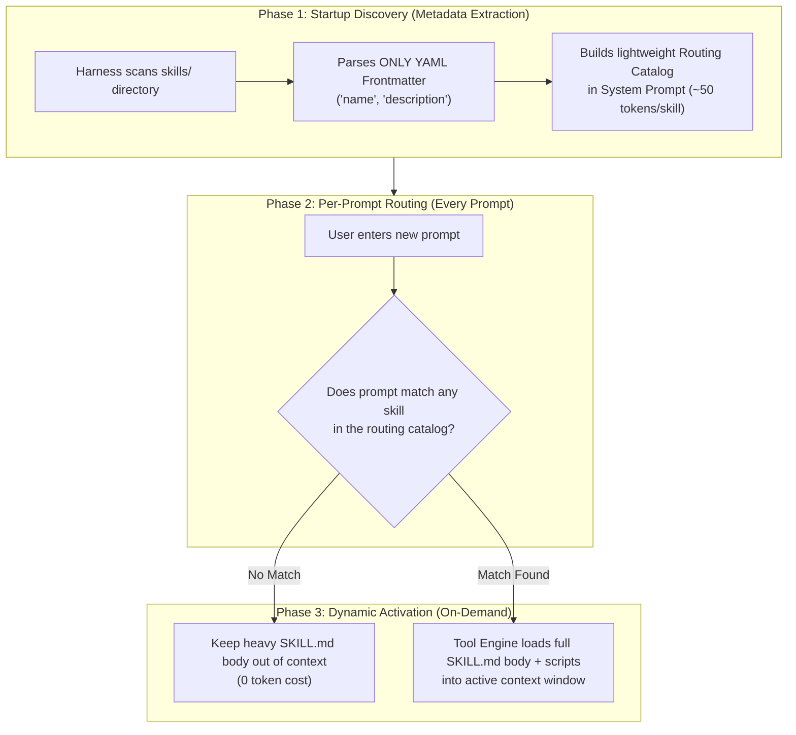

### Does the Agent Check Skills Files After Every Prompt?
**Only dynamically on demand.** The agent never reads the full text of all skill files on every prompt:
1. **At Startup / Session Launch (Catalog Construction)**: The harness scans skill folders and extracts *only* the top YAML frontmatter (`name` and `description`). This creates a micro-catalog in the system prompt.
2. **After Every Prompt (The Routing Evaluation)**: The LLM evaluates incoming user queries against the names and descriptions in the resident catalog to decide if specialized domain context is required.
3. **Dynamic Activation (Context Injection)**: Only when a relevant match occurs does the harness execute a file read to inject the full `SKILL.md` body and supporting assets into the active context window.
4. **Manual Slash-Command Override**: Setting `disable-model-invocation: true` in the YAML frontmatter prevents the LLM from auto-triggering the skill, making it invokable strictly via manual user command (e.g. `/deploy`).

### Harness vs. Model Separation of Concerns
* **The Raw Model**: A stateless next-token predictor. It has no autonomous ability to scan directories or decide to pull scripts from disk.
* **The Harness Wrapper**: Manages file indexing, constructs the system prompt catalog, detects when the model requests a skill, and streams the markdown content into the context window.

---

## 10. Why Ask Mode Cannot Read Skills & How to Enforce Formatting

### Why "Formatting-Only" Skills Cannot Run in Ask Mode
A common misconception is that skills must always contain executable code or bash scripts. In reality, a skill can be a purely structural text-formatting guideline (e.g., enforcing JSON schemas or visual markdown tables).

However, **Ask Mode still cannot read or invoke formatting-only skills** due to two architectural constraints:

1. **Context Window Routing & Token Optimization**:
   * Ask Mode is optimized for ultra-low Time-To-First-Token (TTFT) and minimal token overhead.
   * To achieve this, the harness compiler purges the tool engine, function-calling schemas, and skill registries from the system prompt entirely. It never scans or injects `.cursor/skills` or `skills/` directories in Ask Mode.
2. **Absence of Parser Middleware**:
   * Agent Mode runs a **ReAct loop** (Reasoning + Acting) with background execution middleware that checks whether a skill needs to be pulled in and parses its instructions.
   * Ask Mode lacks this active execution runtime; it passes user messages directly through a flat, linear inference pipeline.

### How to Apply Rules Across Modes

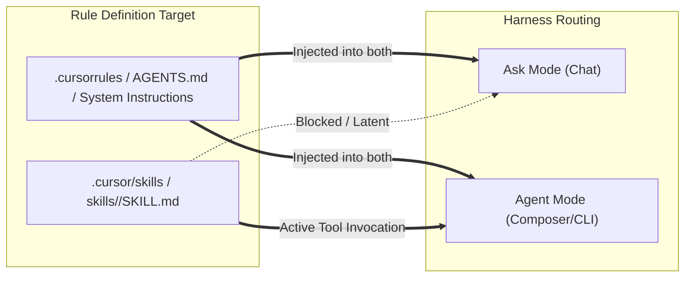

### Best Practice Configuration

* **For Formatting & Response Style (Both Ask and Agent Modes)**:
  Place instructions in `.cursorrules`, `AGENTS.md`, or the global IDE AI profile.
  ```markdown
  # Formatting & Response Guidelines
  - Always lead with a 1-2 sentence executive summary.
  - Separate conceptual explanation from code blocks.
  - Use GitHub-flavored markdown tables and Mermaid diagrams for architectural comparisons.
  ```
* **For Procedural Agent Workflows (Agent Mode Only)**:
  Structure as discrete skills with explicit trigger conditions in `SKILL.md`:
  ```markdown
  ---
  name: deploy-staging
  description: Executes staging deployment pipeline with pre-flight linting and test validation.
  ---
  # Staging Deployment Workflow
  1. Run test suite: `pytest -v`
  2. Verify build artifacts
  3. Dispatch deployment script
  ```
* **Bypassing Ask Mode Filtering**:
  To force Ask Mode to evaluate a skill file or passive instruction, explicitly reference it in your prompt using `@SKILL.md` to convert it into an explicit RAG context attachment.

---

## 11. Summary Reference Guide

```
+---------------------------------------------------------------------------------------------------+
|                                AGENT HARNESS ENGINEERING SUMMARY                                  |
+----------------------------------+----------------------------------------------------------------+
| Concept                          | Core Principle & Technical Reality                             |
+----------------------------------+----------------------------------------------------------------+
| The Fundamental Equation         | Agent = Model + Harness. The LLM is text-in/text-out;          |
|                                  | the harness is the deterministic driver & execution wrapper.   |
+----------------------------------+----------------------------------------------------------------+
| Tool-Calling V1 vs V2            | V1 text parsing suffers from hallucinated results & bad JSON;  |
|                                  | V2 native schemas use fine-tuned tokens & constrained grammar. |
+----------------------------------+----------------------------------------------------------------+
| Context Sanitization             | Harness must strip HTML/JS/CSS and summarize large tool outputs|
|                                  | to prevent context bloat and prompt cache invalidation.        |
+----------------------------------+----------------------------------------------------------------+
| Caching Location                 | Server-side GPU VRAM (KV Cache); local storage only holds RAG  |
|                                  | vector indexes, embeddings, and transcript logs.               |
+----------------------------------+----------------------------------------------------------------+
| Cache Keying & TTL               | Exact prefix cryptographic hashing from token 0;               |
|                                  | sliding TTL: Anthropic ~5 min; OpenAI ~30 min to 24 hr.        |
+----------------------------------+----------------------------------------------------------------+
| Mid-Chat Model Switch            | Incurs 100% full input re-ingestion cost; cross-model KV caches|
|                                  | cannot be shared across different architectures.              |
+----------------------------------+----------------------------------------------------------------+
| "Coffee Break" Penalty           | Pausing >5 min on large transcripts drops the KV cache,        |
|                                  | incurring full cache-write re-computation on next message.     |
+----------------------------------+----------------------------------------------------------------+
| Ask Mode vs. Agent Mode          | Ask Mode = Sandboxed RAG retrieval (read-only);                |
|                                  | Agent Mode = Full tool-calling loop (FS, Shell, Skills, MCP).  |
+----------------------------------+----------------------------------------------------------------+
| Skills & MCP Architecture        | Registered as latent tools via Dynamic Discovery; full bodies  |
|                                  | injected only upon invocation to preserve prompt caching.      |
+----------------------------------+----------------------------------------------------------------+
```
