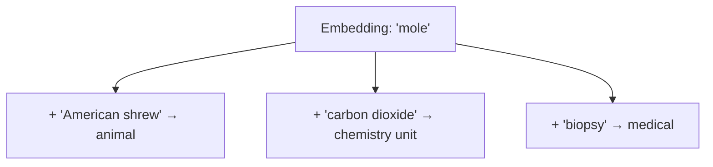
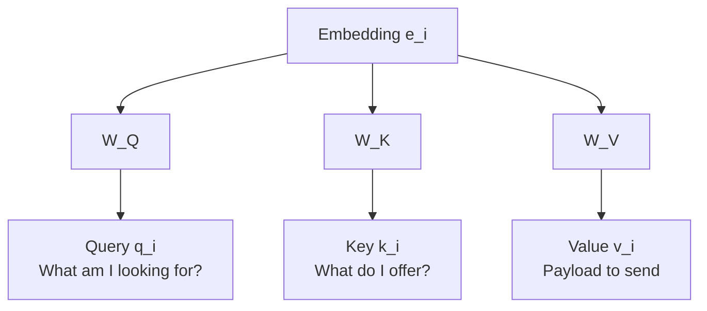
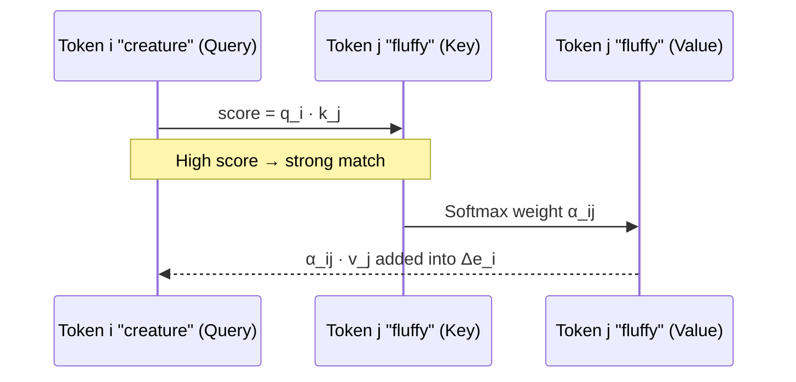
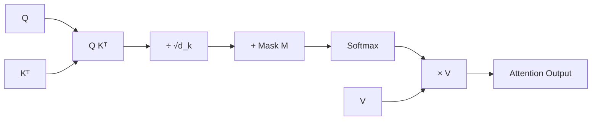
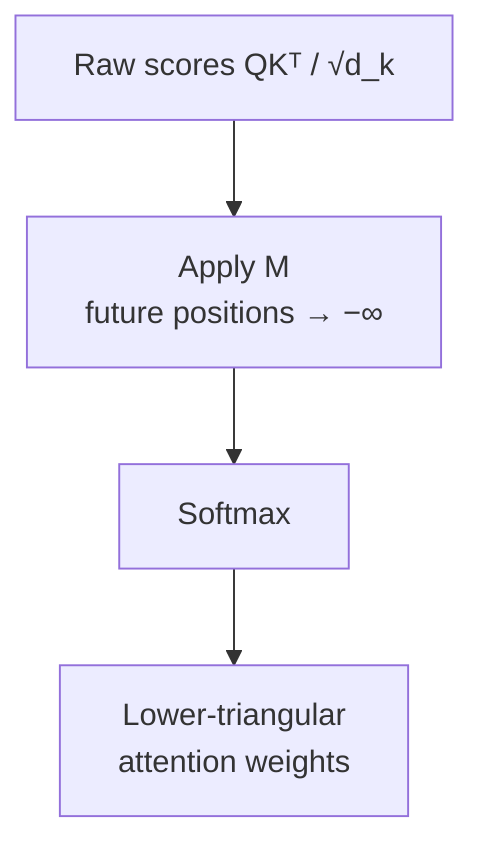
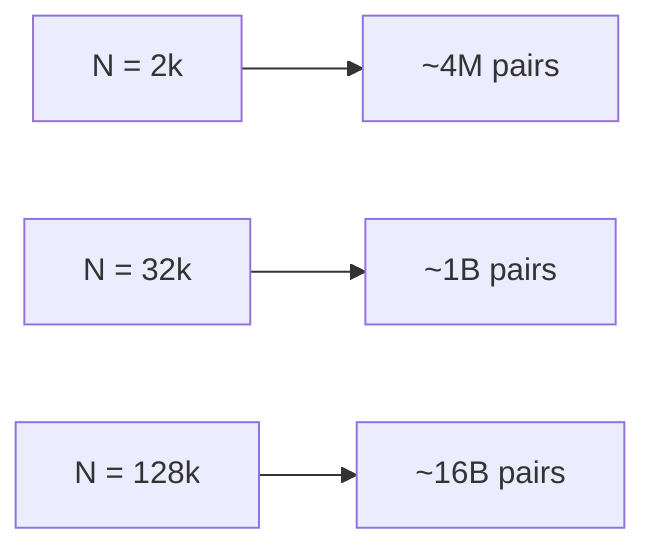
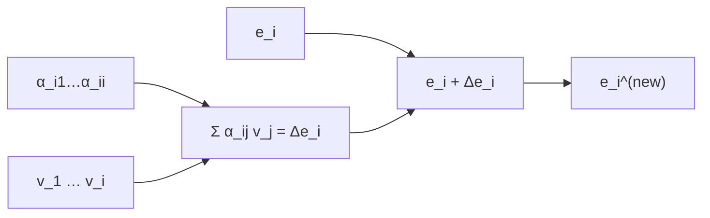
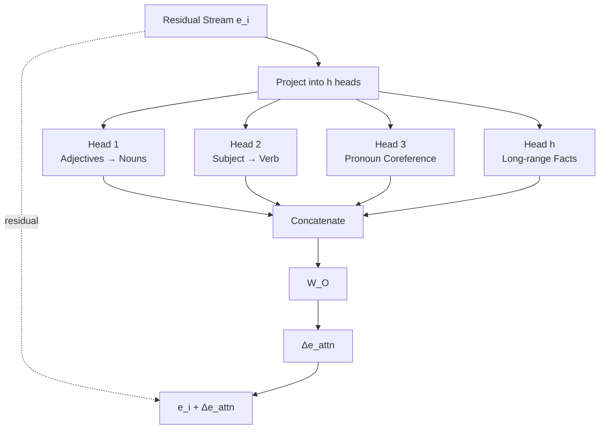
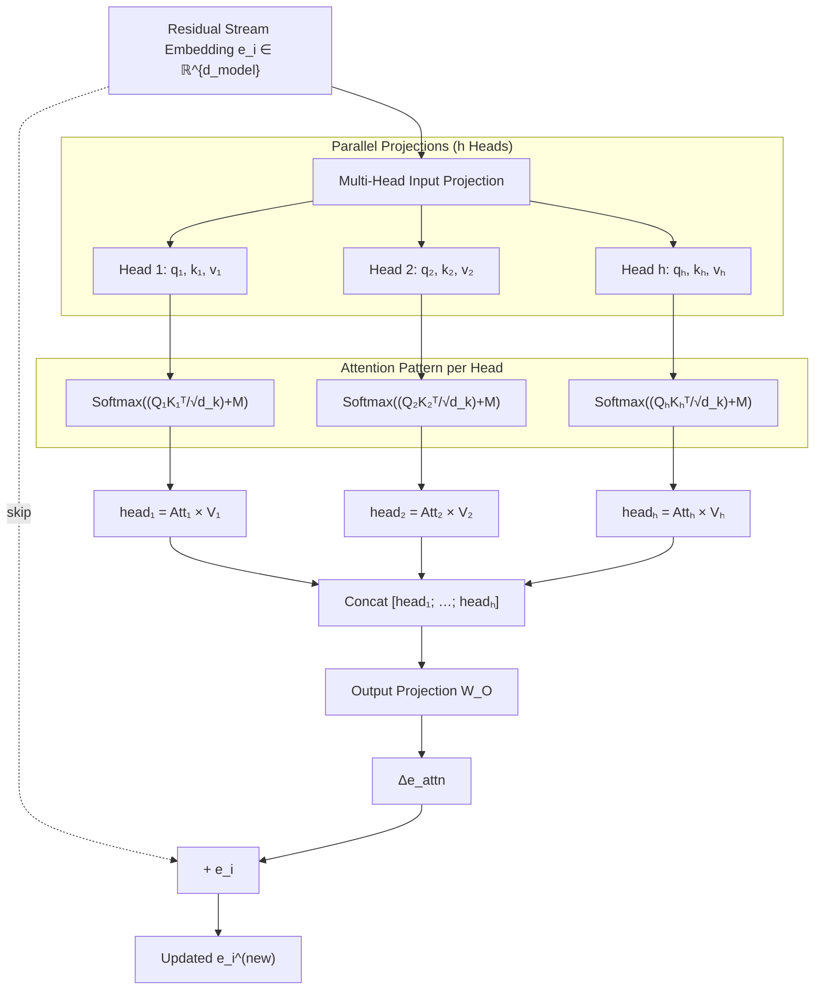
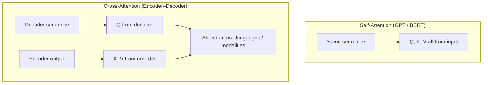

# The Attention Mechanism

---

## 1. Motivation & Contextual Refinement

Initial token embeddings $e_i$ are extracted static vectors with no knowledge of surrounding words. However, word meanings depend heavily on context:

* **Polysemy Resolution**: The word *"mole"* in:
  1. *"American shrew mole"* $\rightarrow$ Animal direction.
  2. *"One mole of carbon dioxide"* $\rightarrow$ Chemistry unit direction.
  3. *"Biopsy of the mole"* $\rightarrow$ Dermatology/medical direction.
* **Contextual Nuance Refinement**: Adding modifiers like *"Eiffel"* or *"miniature"* to *"tower"* progressively updates the token vector from a generic tall structure toward Paris landmark coordinates or small scale-model attributes.



> [!IMPORTANT]
> **Core Purpose of Attention**: Attention lets a token's vector pull in information from other positions and update its directional value in embedding space based on context.
>
> **Caveat on direction of flow**: In a **causal (decoder-only) model like GPT**, information flow is *one-directional* — a token at position $i$ can only read from positions $j \le i$, never from future tokens (see Causal Masking below). Truly bidirectional "back and forth" exchange within a single layer happens in **encoder / masked-LM models like BERT**, not in GPT. Across stacked layers, context still propagates forward only.

---

## 2. Mechanics of a Single Self-Attention Head

For each token embedding vector $e_i \in \mathbb{R}^{d_{\text{model}}}$ in a context sequence, a single attention head transforms the vector into three smaller projection vectors: **Query ($q_i$)**, **Key ($k_i$)**, and **Value ($v_i$)**.



### 1. Queries ($q_i$) — "What information am I looking for?"
* **Projection Matrix ($W_Q$)**: $d_k \times d_{\text{model}}$ (where $d_k = 128$ for GPT-3).
* **Query Vector**: $q_i = W_Q e_i \in \mathbb{R}^{d_k}$.
* **Example Role**: A noun vector (e.g., `"creature"`) generates a query asking: *"Are there any preceding adjectives describing me?"*

### 2. Keys ($k_i$) — "What attributes/information do I possess?"
* **Projection Matrix ($W_K$)**: $d_k \times d_{\text{model}}$ (where $d_k = 128$).
* **Key Vector**: $k_i = W_K e_i \in \mathbb{R}^{d_k}$.
* **Example Role**: An adjective vector (e.g., `"fluffy"` or `"blue"`) generates a key advertising: *"I am a descriptive adjective in position i."*

### 3. Relevance Alignment & Dot Product Attention
The compatibility or relevance score between token $i$ (Query) and token $j$ (Key) is measured using the inner product:
$$\text{Score}_{i,j} = q_i \cdot k_j = q_i^T k_j$$
High dot products indicate strong semantic alignment between query requirements and key contents.



---

## 3. The Scaled Dot-Product Attention Equation

Matrix formulation for the complete sequence of length $N$:

$$\text{Attention}(Q, K, V) = \text{softmax}\left( \frac{Q K^T}{\sqrt{d_k}} + M \right) V$$

Where:
* $Q \in \mathbb{R}^{N \times d_k}$: Matrix of query vectors.
* $K \in \mathbb{R}^{N \times d_k}$: Matrix of key vectors.
* $V \in \mathbb{R}^{N \times d_v}$: Matrix of value vectors.
* $\sqrt{d_k}$: **Scaling Factor** (prevents dot products from growing excessively large in high dimensions, which would cause Softmax gradients to vanish).
* $M$: **Causal Masking Matrix**.



Attention pattern (lower-triangular after causal masking):

```
Attention Pattern Matrix (N × N)
        Tok1   Tok2   Tok3   ...   TokN
Tok1  [ 1.0  |  0    |  0    | ... |  0   ]  ← cannot see future
Tok2  [ 0.3  |  0.7  |  0    | ... |  0   ]
Tok3  [ 0.1  |  0.6  |  0.3  | ... |  0   ]
 ...  [ ...  |  ...  |  ...  | ... | ...  ]
TokN  [ a₁   |  a₂   |  a₃   | ... |  a_N ]
```

---

## 4. Causal Masking & Context Bottleneck

### Causal Masking ($M$)
* In autoregressive generation (GPT), a token at position $i$ must **never** attend to future tokens ($j > i$), as that would leak target predictions during training.
* Implementation: Before applying Softmax, entries where $j > i$ are set to $-\infty$:
  $$M_{i,j} = \begin{cases} 0 & \text{if } j \le i \\ -\infty & \text{if } j > i \end{cases}$$
* Softmax maps $e^{-\infty}$ to $0$, creating a strictly lower-triangular attention probability matrix.



### Context Size Quadratic Bottleneck
Because the attention pattern matrix is of size $N \times N$ (where $N$ is context length), both computational time and memory scale quadratically: $O(N^2)$.

> [!NOTE]
> This describes standard **dense** attention. The actual GPT-3 alternated dense and locally-banded **sparse** attention layers to reduce this cost, and modern models add further tricks (FlashAttention, sliding-window, GQA/MQA). The $O(N^2)$ figure is the baseline, not the last word.



### Inference: KV Cache (why past $K$/$V$ are kept)

At **training** or prompt **prefill**, many tokens can be processed in parallel. At **decode**, the model emits one token at a time. Without caching, each new step would recompute Keys and Values for the entire past sequence.

**KV cache** stores past $K$ and $V$ tensors so each decode step only projects the newest token, appends its $K$/$V$, and attends against the cache. That buys real-time generation—but cache size grows with context length and batch size, and every decode step must reload the cache from GPU HBM (often the true bottleneck, not FLOPs).

Because a full cache is expensive, systems either:
- **Shrink structurally** (fewer KV heads via GQA/MQA),
- **Drop / sparsify** which past tokens stay addressable (sliding window, eviction policies like H2O / StreamingLLM sinks),
- **Compress** cached tensors (KV quantization), or
- **Replace** some layers with linear/recurrent state (e.g. KDA) so those layers do not grow a full KV list—often hybridized with a few dense/MLA layers for retrieval quality.

Tradeoff in one line: sparse or compressed attention saves memory/compute, but can miss mid-context “needles” and hurt long-horizon reasoning if the dropped history mattered. Interview-depth Q&A: `Questions.md` **Q5**, **Q12**, **Q21**, **Q22**.

---

## 5. Value Vectors ($v_i$) & Vector Updates

Once the attention pattern weights $\alpha_{i,j}$ are computed via Softmax:
1. **Value Projection**: $v_j = W_V e_j$.
2. **Weighted Sum of Values**:
   $$\Delta e_i = \sum_{j=1}^{i} \alpha_{i,j} v_j$$
3. **Residual Stream Update**: The change $\Delta e_i$ is added back to the original embedding $e_i$:
   $$e_i^{(\text{new})} = e_i + \Delta e_i$$



### Low-Rank Factorization of the Value Matrix
Rather than mapping directly $d_{\text{model}} \to d_{\text{model}}$ (which would require $12,288 \times 12,288 \approx 150\text{M}$ params per head), the value matrix is factored into two low-rank matrices:
* **$W_{\text{down}}$**: Maps $d_{\text{model}} \to d_k$ ($12,288 \to 128$).
* **$W_{\text{up}}$** (Output Projection Component): Maps $d_k \to d_{\text{model}}$ ($128 \to 12,288$).

---

## 6. Multi-Head Attention (MHA)

Rather than performing a single attention operation, transformers execute $h$ distinct attention heads in parallel ($h = 96$ in GPT-3).





* **Purpose**: Different heads specialize in learning distinct types of relationships (syntactic parsing, coreference resolution, subject-verb agreement, semantic association).
* **Output Projection Matrix ($W_O$)**: Combines the output vectors from all $h$ parallel heads into a single vector added to the residual stream.

---

## 7. Cross-Attention vs. Self-Attention



| Attribute | Self-Attention (e.g., GPT, BERT) | Cross-Attention (e.g., Encoder-Decoder Translation) |
| :--- | :--- | :--- |
| **Source of Queries ($Q$)** | Input sequence | Decoder sequence (target language) |
| **Source of Keys ($K$) & Values ($V$)** | Same input sequence | Encoder output sequence (source language) |
| **Causal Masking** | Applied in autoregressive decoders | Not applied (full context accessible across languages) |
| **Primary Use** | Autoregressive generation, language modeling | Machine translation, speech-to-text |

---

## 8. Parameter Count Breakdown (GPT-3 Benchmark)

For GPT-3 ($d_{\text{model}} = 12,288$, $d_k = 128$, $h = 96$ heads per layer, $L = 96$ layers):

### 1. Single Attention Head Parameters
* $W_Q$: $12,288 \times 128 = 1,572,864$
* $W_K$: $12,288 \times 128 = 1,572,864$
* $W_{\text{value-down}}$: $12,288 \times 128 = 1,572,864$
* $W_{\text{value-up}}$: $128 \times 12,288 = 1,572,864$
* **Per Head Subtotal**: $\approx 6.29 \text{ Million parameters}$

### 2. Multi-Head Attention Block (Per Layer)
* 96 Heads $\times 6.29\text{M} \approx 604 \text{ Million parameters per layer}$

### 3. Total Across All 96 Layers
* $96 \text{ Layers} \times 604\text{M} \approx \mathbf{58 \text{ Billion parameters}}$ ($\approx 33\%$ of GPT-3's total 175B parameters).
