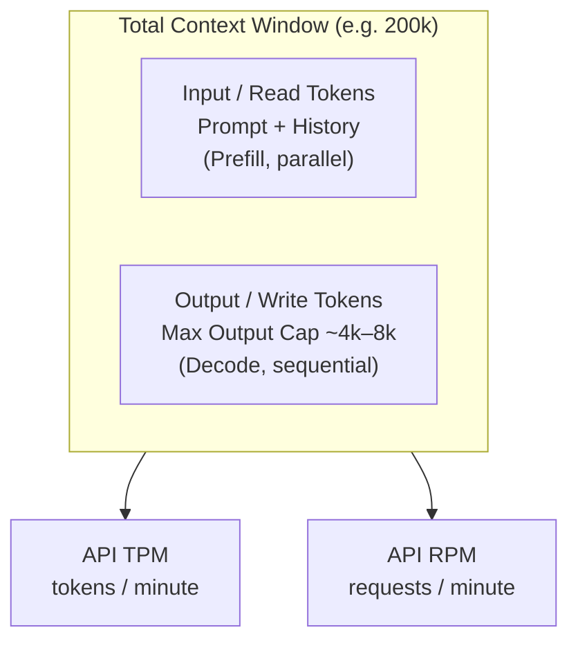
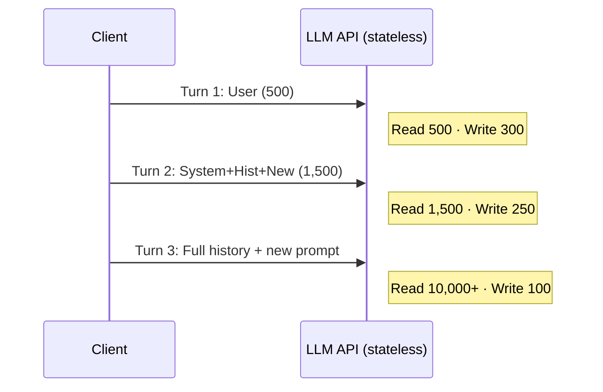
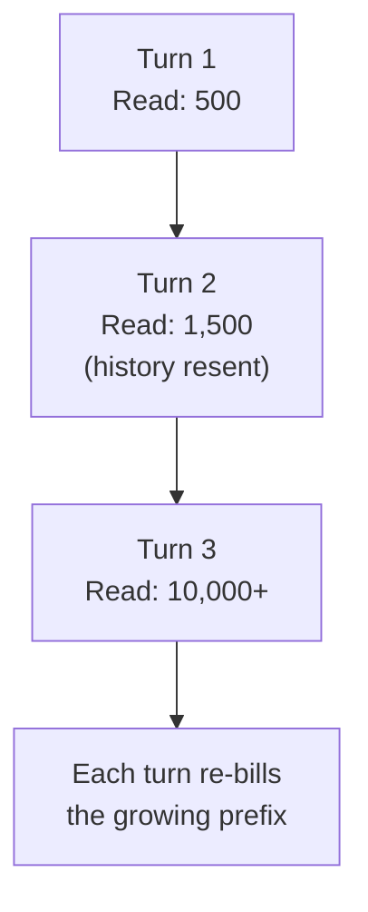
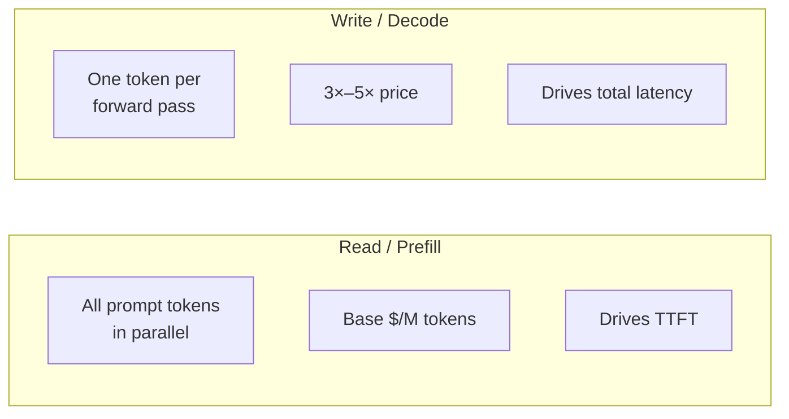
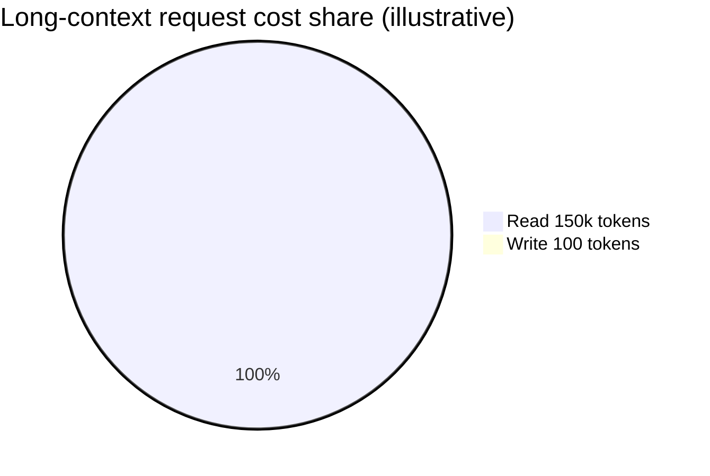
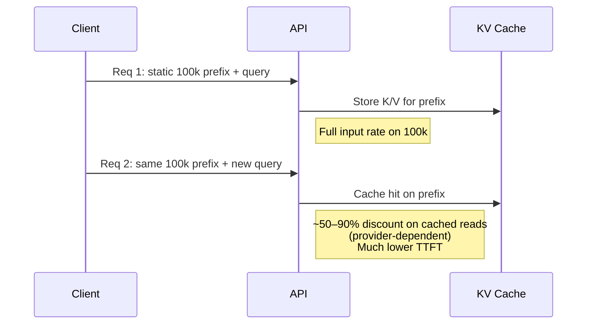
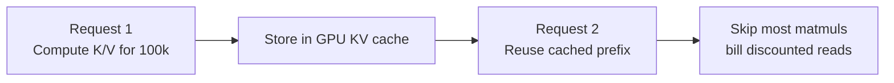
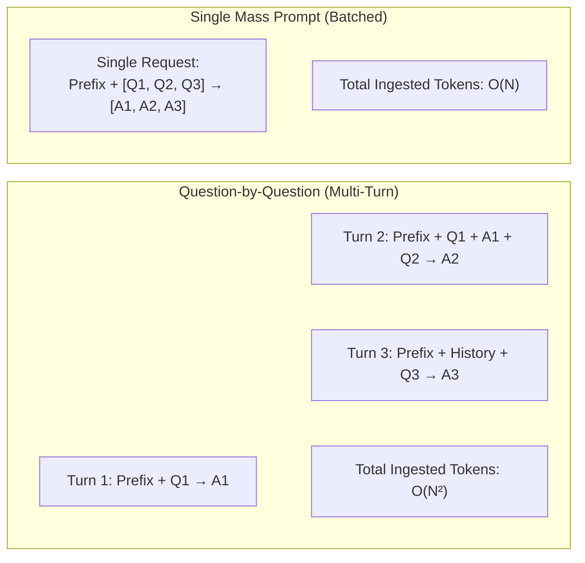
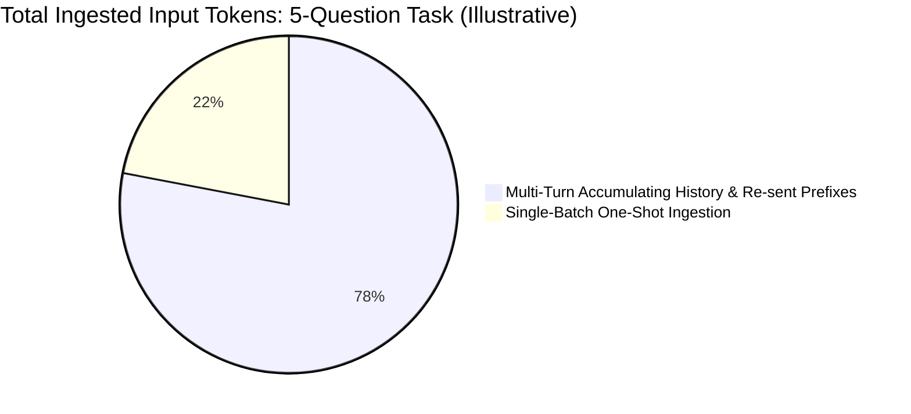

# LLM Context Window, Token Limits & Billing Q&A

---

## 1. Context Window, Read vs. Write Tokens, & Rate Limits

### Q1: Are token limits given by Claude / OpenAI for both read and write tokens? How do they differ?

**Answer**:
Yes, but they apply in distinct ways across three key concepts: **Context Window**, **Max Generation Caps**, and **API Rate Limits**.

> [!NOTE]
> The specific model numbers below are **snapshots that age quickly** — always check the current model card. As of early 2026, frontier context windows have grown to ~1M tokens and max-output caps into the tens/hundreds of thousands (e.g. Claude Sonnet 5 ships a 1M context window with 128k max output). The *concepts* (shared pool, separate output cap, rate limits) are what stay true.

1. **Context Window Size (Buffer Cap)**:
   * This is the total capacity of the model's memory buffer per single API request.
   * It includes **both** **Read (Input/Prompt)** tokens and **Write (Output/Completion)** tokens combined.
   * *Example (2024-era)*: Claude 3.5 Sonnet had a $200{,}000$ token context window; GPT-4o had a $128{,}000$ token window.
2. **Max Output Token Cap (Generation Limit)**:
   * Models have an explicit hard cap on how many **Write (Output)** tokens they can generate in a single response, regardless of how much space is left in the context window.
   * *Example (2024-era)*: A model with a $200\text{k}$ context window may have a max output limit of $4,096$ or $8,192$ write tokens per turn. Newer models raise this dramatically.
3. **API Rate Limits (TPM & RPM)**:
   * **TPM (Tokens Per Minute)**: The maximum combined volume of input + output tokens your API key can process across all requests in a 60-second window.
   * **RPM (Requests Per Minute)**: The maximum number of individual HTTP calls allowed per minute.

---

## 2. Statelessness & Read Token Costs

### Q2: If the context window is fully filled, does every prompt cost a lot of read tokens?

**Answer**:
**Yes, absolutely.** LLMs operate statelessly over HTTP API endpoints. The model retains no internal session memory between API calls.

* To maintain multi-turn dialogue, the client application must re-send the **entire preceding message history** (system instructions, previous user queries, assistant responses) alongside the new prompt.
* If your conversation history reaches $100,000$ tokens, simply asking *"What is 2 + 2?"* (3 tokens) requires the model to read and process $100,003$ **input/read tokens**.

---

## 3. Marginal Impact of Extra Words & Cost Breakdown

### Q3: As the context window fills up, does writing an extra character or word take up percentage-wise less of the full limit? How does this impact costs?

**Answer**:
There are two ways to look at this: **Context Capacity Percentage** vs. **Cost & Computation Dynamics**.

#### 1. Context Capacity Percentage
From a purely structural percentage standpoint, **yes**.
* Adding 1 extra word ($\approx 1.5$ tokens) into a small 1,000-token context accounts for $+0.15\%$ of the total context.
* Adding that same 1 extra word into a 150,000-token context accounts for only $+0.001\%$ of the total context limits.

#### 2. Read (Input) vs. Write (Output) Pricing & Compute Dynamics

| Dimension | Read / Input Tokens (Prefill Phase) | Write / Output Tokens (Decode Phase) |
| :--- | :--- | :--- |
| **Execution Mechanics** | **Parallel**: All prompt tokens are matrix-multiplied simultaneously on GPU tensor cores. | **Sequential**: Tokens are generated autoregressively one by one ($T$ forward passes required for $T$ tokens). |
| **Price Ratio** | **Base Cost ($1\times$)**: ~$\$2.50 - \$3.00$ per million tokens *for 2024-era mid-tier models (GPT-4o / Claude 3.5 Sonnet); varies widely by model.* | **Premium (commonly $3\times - 5\times$ input cost)**: ~$\$10.00 - \$15.00$ per million tokens for those same models. |
| **Latency Impact** | Adds initial latency (**Time to First Token - TTFT**). | Dominates overall generation time (**Inter-Token Latency**). |

#### Cost Summary Rule:
* **Output tokens are significantly more expensive per token** than input tokens ($3\times - 5\times$ cost difference) due to GPU serial decoding constraints.
* **However, in a bloated context window**, input read costs overwhelmingly dominate total billings. If a request processes $150,000$ read tokens ($150\text{k} \times \$3/\text{M} = \$0.45$) and generates $100$ write tokens ($100 \times \$15/\text{M} = \$0.0015$), **$99.7\%$ of the request cost comes from reading the context history**.

---

## 4. Mitigation: Prompt Caching (KV Caching)

### Q4: How do modern LLM providers reduce the high cost of large context windows?

**Answer**:
To eliminate redundant prompt processing costs, modern AI providers (Anthropic Claude, OpenAI, DeepSeek, Google Gemini) utilize **Prompt Caching (KV Caching)**.

* **How it Works**: The Key ($K$) and Value ($V$) activations computed for a prompt prefix are retained (in GPU VRAM, high-speed NVMe, or a managed cache tier) so an identical prefix on a later request can skip recomputation.
* **Speedup**: Dramatically reduces Time-To-First-Token (TTFT) on cache hits by avoiding redundant matrix multiplications during prefill.

#### Provider Cache Architecture, TTL & Billing Comparison

| Provider / Model | Caching Type | Default Inactivity TTL | Cache Write Cost | Cache Read (Hit) Cost | Eviction / Storage Model |
| :--- | :--- | :--- | :--- | :--- | :--- |
| **Anthropic** *(Claude 3.5/3.7 Sonnet, Opus)* | **Explicit** (`cache_control`) | **5 minutes** (sliding); optional 1-hr tier | **$1.25\times$** base input ($2\times$ for 1-hr) | **$0.10\times$** ($90\%$ off) | Strict sliding TTL. Re-evaluates entire prefix upon expiration. |
| **OpenAI** *(GPT-4o, o1, o3-mini)* | **Automatic** (Prefix $>1{,}024$ tok) | **5–10 minutes** (up to 1 hr off-peak) | **$1.0\times$** base input (No write fee) | **$0.50\times - 0.20\times$** ($50\% - 80\%$ off) | Automatic in-memory cache; evicted dynamically based on server load. |
| **Google Gemini (Implicit)** *(2.0 Flash / Pro)* | **Automatic** | System-managed | **$1.0\times$** base input | **$\approx 75\% - 90\%$ off** | No storage fee; opportunistic caching. |
| **Google Gemini (Explicit)** *(1.5 Pro, 3.7 Flash)* | **Explicit** (`CachedContent`) | User-defined (**1 hour** default) | **$1.0\times$** base input | **$75\% - 90\%$ off** | **Hourly Storage Fee**: Charged per 1M tokens/hour (e.g. $\$0.50 - \$1.00/\text{M}/\text{hr}$) for duration of TTL. |
| **DeepSeek** *(DeepSeek-V3, R1)* | **Automatic** (Multi-tier) | System-managed / Opportunistic | **$1.0\times$** base input | **$\approx 90\%$ off** ($\$0.014/\text{M}$) | Multi-tier NVMe/RAM cache; auto-evicted on cluster memory pressure. |
| **AWS Bedrock** *(Claude, Titan)* | **Explicit** (`cachePoint`) | **5 minutes** (sliding) | **$1.25\times$** base input | **$90\%$ off** | Explicit cache markers; sliding TTL resets on hit. |

---

## 5. Request Strategy: Question-by-Question vs. Batched Prompts

### Q5: Why does asking questions one-by-one cost significantly more than sending a single batched prompt?

**Answer**:
Sending questions sequentially one-by-one in separate turns or API requests generally costs significantly more than sending a single batched prompt containing all questions, even when the total question text is identical.

#### 1. Why Question-by-Question Costs More
1. **Instruction & System Prompt Repetition**: Every distinct API call or chat turn resends the core instructions, system prompts, schemas, and formatting rules. In multi-turn setups, this static background text is billed as input tokens repeatedly on every request.
2. **Accumulating Chat History ($\mathcal{O}(N^2)$ Ballooning)**: Within a continuous conversation thread, the system automatically includes all preceding questions and assistant completions in every new turn. Input token count balloons with each step ($Q_1$ is sent once, but by $Q_N$, questions and answers $1$ through $N-1$ are resent repeatedly):
   $$\text{Total Input Tokens} \approx \sum_{k=1}^N \left( S + \sum_{i=1}^{k-1} (|Q_i| + |A_i|) + |Q_k| \right) \sim \mathcal{O}(N^2)$$
   *(where $S$ is system prompt size, $Q_i$ is question length, and $A_i$ is completion length)*.
3. **Request & Framing Overhead**: Multiple distinct calls incur repeated connection overhead, token framing costs, and separate output completion generations rather than a single continuous decode stream.

#### 2. Why a Single Mass Text Prompt is Cheaper
1. **Shared Single Context**: Instructions, reference documents, few-shot demonstrations, and rules are ingested precisely **once** as a single input block ($\mathcal{O}(N)$ total input).
2. **Prompt Caching Maximization**: With providers supporting prompt caching (e.g., Anthropic, OpenAI, DeepSeek, Google Gemini), sending a large, identical block of context in one request maximizes cache hits for any downstream evaluation and minimizes repeated prefill computation.

| Dimension | Question-by-Question (Multi-Turn) | Batched Mass Prompt (Single Request) |
| :--- | :--- | :--- |
| **System Prompt Ingestion** | Re-billed $N$ times across turns | Billed exactly once |
| **History Overhead** | Accumulating history resent on every turn ($\mathcal{O}(N^2)$) | Zero accumulated history ($\mathcal{O}(N)$ total) |
| **Network & Connection Overhead** | $N$ HTTP roundtrips and generation handshakes | $1$ HTTP roundtrip and single generation stream |
| **Prompt Caching Benefit** | Cache discounts apply to prefix, but history suffix still grows | Full context prefilled once / high caching efficiency |

> [!TIP]
> **Optimization Rule of Thumb**: If questions share a large background document or static evaluation instructions, always consolidate them into a single structured prompt (e.g., JSON array or numbered list) to minimize quadratic history re-billing.

---

## 6. Summary Reference Table

| Parameter | Read / Input Tokens | Write / Output Tokens |
| :--- | :--- | :--- |
| **Primary Phase** | Prefill (Prompt ingestion) | Decode (Autoregressive sampling) |
| **GPU Utilization** | Compute-bound (highly parallelized) | Memory-bandwidth bound (sequential forward passes) |
| **Context Window Consumption** | Shares combined context pool ($N_{\text{input}} + N_{\text{output}} \le N_{\text{max}}$) | Shares combined pool + subject to Max Output limit |
| **Cost Dominance** | Dominates cost in multi-turn long-context chats | Dominates cost in short-prompt / long-form text generation |
