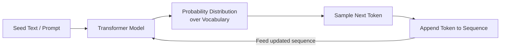
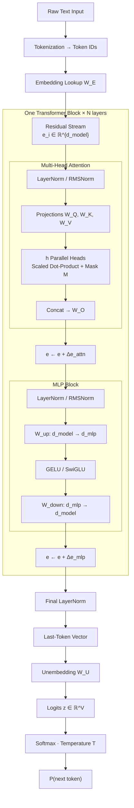
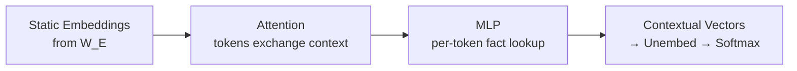
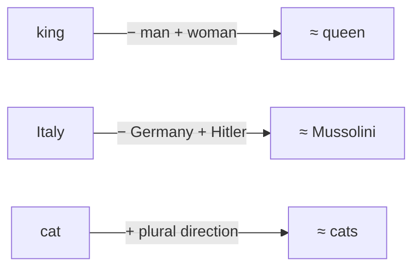
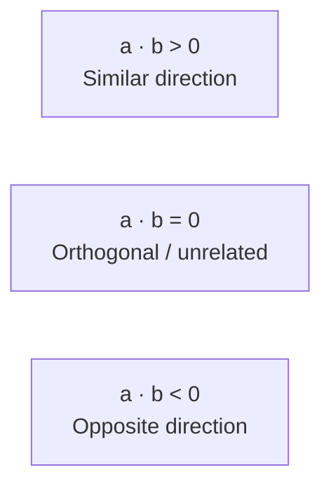
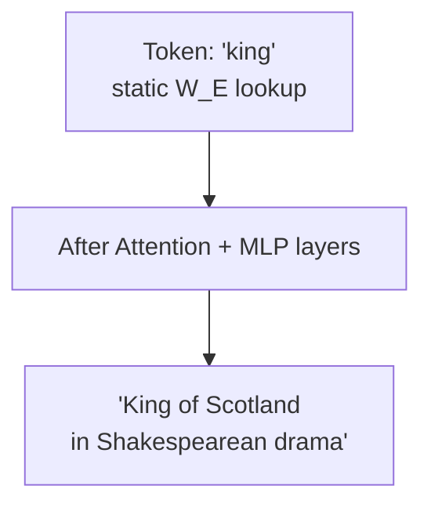
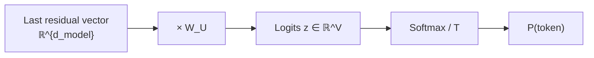
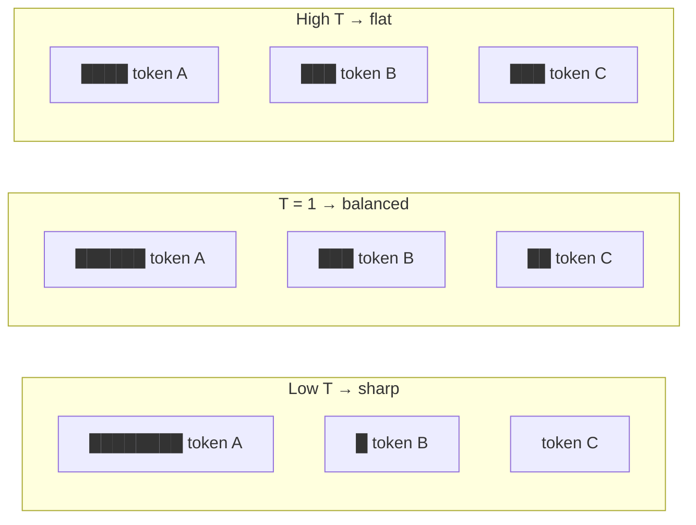

# GPT Architecture & High-Level Transformer Overview

---

## 1. Core Definitions & Premise

### What does GPT Stand For?
- **Generative**: The model generates new text sequentially by predicting the next token.
- **Pretrained**: The model undergoes initial training on a massive dataset of unlabelled text to learn general syntax, world knowledge, and semantic representations before any task-specific fine-tuning.
- **Transformer**: The underlying neural network architecture introduced by Google in 2017 (*"Attention Is All You Need"*), which replaced recurrent architectures (RNNs/LSTMs) with a parallelizable, attention-based mechanism.

### Applications of Transformers
Transformers are multimodal foundation models used across various domains:
- **Text-to-Text**: Machine translation, summarization, conversational AI (ChatGPT, Claude, Gemini).
- **Text-to-Image / Multimodal**: DALL-E, Midjourney, Stable Diffusion. (Note: these are primarily **diffusion** models; transformers often appear as the text encoder or as a diffusion-transformer backbone, not as the whole system.)
- **Audio**: Speech recognition (Whisper) and synthetic speech generation.

---

## 2. The Predict, Sample, & Repeat Loop

At its fundamental level, an autoregressive language model is a **probabilistic next-token predictor**.

### Process Breakdown
1. **Input**: A passage of seed text (prompt).
2. **Prediction**: The transformer processes the passage and outputs a probability distribution over all possible next tokens in its vocabulary.
3. **Sampling**: A token is selected from the distribution based on sampling parameters (e.g., Temperature, Top-k, Top-p).
4. **Append & Repeat**: The sampled token is appended to the passage, and the entire updated sequence is fed back into the model to predict the subsequent token.

> [!NOTE]
> **Model Scaling Effect**: While smaller models (e.g., GPT-2) running this loop often produce repetitive or incoherent text, scaling up model parameters and training data (e.g., GPT-3, GPT-4) leads to coherent reasoning, contextual inference, and emergent problem-solving skills.

---

## 3. Data Flow Inside a Transformer

The overall architecture transforms discrete text inputs into continuous high-dimensional vector representations, refines them through multiple layers, and converts the final representation back into token probabilities.

High-level residual-stream view (what each block *does*):

---

## 4. Vector Embeddings (Word to Vector)

### High-Dimensional Geometric Space
In deep learning, discrete tokens are mapped to continuous vectors in an embedding space of dimension $d_{\text{model}}$ (for GPT-3, $d_{\text{model}} = 12,288$).

### Semantic Directions in Vector Space
During training, the model arranges token vectors such that specific spatial directions tend to correspond to semantic features:

> [!NOTE]
> These linear-analogy examples are the classic **word2vec / GloVe** intuition and are used here as illustration. They are *not* verified clean properties of GPT's learned token embeddings — real analogy behavior is noisier and context is added mostly by later attention/MLP layers rather than the static embedding table.

- **Gender Direction**:
$$\vec{v}_{\text{king}} - \vec{v}_{\text{man}} + \vec{v}_{\text{woman}} \approx \vec{v}_{\text{queen}}$$
- **Geographic / Political Associations**:
$$\vec{v}_{\text{Italy}} - \vec{v}_{\text{Germany}} + \vec{v}_{\text{Hitler}} \approx \vec{v}_{\text{Mussolini}}$$
- **Plurality Direction**:
$$\vec{v}_{\text{cats}} - \vec{v}_{\text{cat}} \approx \vec{d}_{\text{plural}}$$
Taking the dot product of $\vec{d}_{\text{plural}}$ with singular vs. plural words consistently yields higher scalar values for plural terms.

### Measuring Vector Alignment via Dot Product
The dot product measures the similarity and directional alignment between two vectors $\vec{a}$ and $\vec{b}$:
$$\vec{a} \cdot \vec{b} = \sum_{i=1}^{d} a_i b_i = \|\vec{a}\| \|\vec{b}\| \cos(\theta)$$

### The Embedding Matrix ($W_E$)
- **Vocabulary Size ($V$)**: $\approx 50,257$ tokens (words, sub-words, or character sequences).
- **Embedding Dimension ($d_{\text{model}}$)**: $12,288$.
- **Shape**: $V \times d_{\text{model}}$ ($50,257 \times 12,288$).
- **Parameter Count**: $50,257 \times 12,288 \approx 617,558,016$ parameters ($\approx 617\text{M}$).

---

## 5. Embeddings Beyond Words & Context Window

Initial embeddings are static lookup values extracted from $W_E$, containing no surrounding context.

- **Context Accumulation**: As vectors pass through alternating Attention and MLP layers, they soak up context from surrounding tokens. A vector initially representing `"king"` is pulled and adjusted until it encodes `"King of Scotland described in Shakespearean drama"`.
- **Context Size ($N$)**: The maximum number of tokens the model can process simultaneously (for GPT-3, $N = 2,048$).
- **Data Tensor Shape**: Flowing through the network, the sequence is represented as an array of shape $(N \times d_{\text{model}}) = (2048 \times 12288)$.

---

## 6. Unembedding & Logits

At the final layer of the transformer:
1. The **last vector** in the sequence contains the accumulated contextual representation required to predict what comes next.
2. The vector is multiplied by the **Unembedding Matrix ($W_U$)** to map it back from embedding space ($d_{\text{model}}$) to vocabulary space ($V$).

### The Unembedding Matrix ($W_U$)
- **Shape**: $d_{\text{model}} \times V$ ($12,288 \times 50,257$).
- **Parameter Count**: $12,288 \times 50,257 \approx 617\text{M}$ parameters.
- **Output (Logits)**: An unnormalized raw score vector $z \in \mathbb{R}^V$.

---

## 7. Softmax & Temperature Tuning

### Softmax Transformation
To convert raw output logits $z = [z_1, z_2, \dots, z_V]$ into a valid probability distribution $P$ where $\sum P(x_i) = 1$ and $0 \le P(x_i) \le 1$:

$$P(x_i) = \frac{e^{z_i / T}}{\sum_{j=1}^{V} e^{z_j / T}}$$

Where $T$ represents the **Temperature** parameter.

### Temperature ($T$) Effects
| Temperature | Mathematical Behavior | Output Characteristics | Use Case |
| --- | --- | --- | --- |
| **$T = 0$** | Not literally defined in the formula (division by zero); implemented as the limit $T \to 0^+$, i.e. $\text{argmax}(z)$ | Fully deterministic, greedy selection. Often repetitive. | Code generation, math, factual Q&A. |
| **Low ($0 < T < 1$)** | Exponentiated logits are sharpened; top probabilities dominate. | Coherent, focused, low variance. | General technical writing, structured text. |
| **Standard ($T = 1.0$)** | Unmodified Softmax distribution. | Balanced creativity and structure. | Conversational dialogue, standard generation. |
| **High ($T > 1.0$)** | Exponentiated logits are flattened; lower-ranked tokens gain weight. | Highly creative, unpredictable, higher risk of hallucination. | Creative brainstorming, poetry. |

---

## 8. Chapter 1 Parameter Summary (GPT-3 Benchmark)

| Component | Matrix Symbol | Dimensions | Parameter Count |
| --- | --- | --- | --- |
| Token Embedding | $W_E$ | $50,257 \times 12,288$ | $\approx 617\text{M}$ |
| Token Unembedding | $W_U$ | $12,288 \times 50,257$ | $\approx 617\text{M}$ |
| **Total Chapter 1 Subtotal** |   |   | **$\approx 1.23\text{ Billion}$** |
