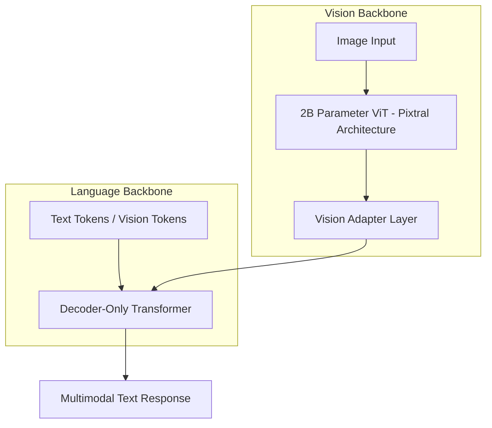
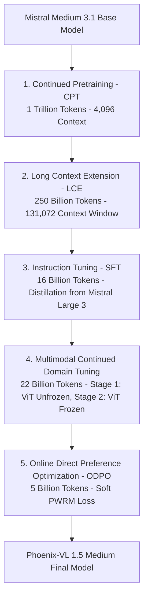
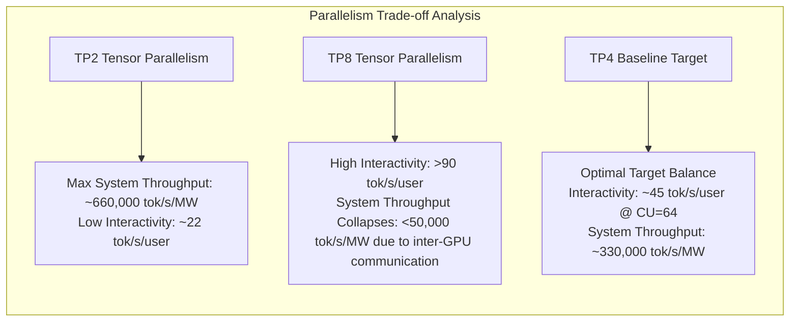

# Phoenix-VL 1.5 Medium Technical Report — Comprehensive Study Notes

## 1. Overview & positioning

- **Model Name:** Phoenix-VL 1.5 Medium
- **Scale:** 123B Parameters (Natively Multimodal & Multilingual Foundation Model)
- **Base Checkpoint:** Mistral Medium 3.1
- **Developers / Organizations:** HTX (Home Team Science & Technology Agency, Singapore) $\times$ Mistral AI
- **Context & Motivation:**
  - **Sovereign AI Asset:** Designed for secure, air-gapped, on-premises deployment across Singapore's public sector and regional enterprise use cases without relying on live web retrieval.
  - **Deep Domain Adaptation:** Internalizes Singapore governance, legislation, local operational terminology, culture, and Southeast Asian (SEA) languages (Malay, Indonesian, Tamil, Chinese) into parameters.
  - **Minimal Alignment Tax:** Demonstrates that deep localized adaptation can be achieved with negligible degradation to broad general multimodal, multilingual, STEM, and coding capabilities.
  - **Predecessor:** Built on the experience of Phoenix 1.0 Small (Team Phoenix, 2025).

---

## 2. Architecture

### Architectural Specifications

| Component | Technical Specification |
| --- | --- |
| **Architecture** | Decoder-only Transformer for auto-regressive text generation |
| **Attention Mechanism** | Grouped Query Attention (GQA) with 96 Query heads & 8 Key-Value (KV) heads |
| **Activation & Normalization** | SwiGLU activation, RMSNorm |
| **Vision Encoder** | 2B Parameter Vision Transformer (ViT) following the Pixtral architecture |
| **Tokenizer** | Tekken Tokenizer (Tiktoken-based, 131,072 vocabulary size, 100+ languages) |
| **Tokenizer Efficiency** | $\sim 30\%$ more token-efficient than SentencePiece on source code and non-English scripts |
| **Vision Token Strategy** | $14 \times 14$ patch size, spatial merge size of 2, special tokens `[IMG]`, `[IMG_BREAK]`, `[IMG_END]` |

---

## 3. Data Engineering & Pretraining Mixture

### 3.1 Design Principles & Sampling Policy
1. **High Quality Tokens:** Usage of classifier-guided quality retention to maximize compute efficiency.
2. **Regional Coverage:** Prioritizes sources absent from the base checkpoint; 53% of pretraining mixture comprises multilingual tokens across 12 languages.
3. **Replay Data:** Retains 11% interleaved image-text replay tokens from base pretraining to prevent catastrophic forgetting.
4. **Sampling Up/Down-scaling:** Default 1 epoch per source. Essential localized corpora (Singapore statutes and policies) are up-sampled up to $4\times$ (or more for ultra-specialized sets), while broad corpora (CommonCrawl) are down-sampled per source.

### 3.2 Quality Control, Decontamination & Deduplication
- **Safety Filtering:** Two-tiered approach: URL domain blocklists and automated text/image classifiers for NSFW, explicit content, and misinformation.
- **Decontamination:** Strict $n$-gram decontamination against localized benchmark test sets to prevent memorization and guarantee evaluation validity.
- **Deduplication:**
  - *Exact:* Substring matching across document fragments.
  - *Fuzzy:* MinHash Locality Sensitive Hashing (LSH) with Jaccard similarity thresholds.

---

## 4. Multi-Stage Training Pipeline

### 4.1 Compute Infrastructure & Cluster Optimization (GB200 & H100 Clusters)

- **Cluster Separation & Workload Allocation:**
  - **Continued Pretraining (CPT):** Executed on an on-premises cluster of **NVIDIA GB200 GPUs** for massive data scale throughput ($1\text{T}$ tokens).
  - **Post-Training & Alignment (SFT, Domain Tuning, ODPO):** Executed on a dedicated **NVIDIA H100 GPU cluster** to enable fast, parallel experiments.
- **Distributed Strategy (FSDP):** Fully Sharded Data Parallelism (FSDP) was empirically selected as the primary parallelization strategy for memory efficiency, stability, and scaling across all GPU nodes.
- **Fault Tolerance & Dynamic Node Allocation:**
  - Across both GB200 (CPT) and H100 (Post-training) clusters, at least **1 node was dedicated as an active standby node**.
  - **Dual Function of Dedicated Node:**
    1. Runs real-time, on-the-fly checkpoint evaluations.
    2. Serves as a hot replacement node in case of hardware failures, eliminating training stalls during GPU node drops.

### 4.2 Breakdown of Training Stages

| Stage | Token Volume | Context Length | Key Methodology & Objectives |
| --- | :---: | :---: | --- |
| **Continued Pretraining (CPT)** | 1 Trillion | 4,096 | Adapts language backbone to SG/SEA languages & knowledge while preserving vision backbone on NVIDIA GB200 cluster. Checkpoints evaluated via late-stage model merging. |
| **Long Context Extension (LCE)** | 250 Billion | 131,072 | Context window extension using YaRN & position-based softmax temperature scaling. Includes short context replay & distillation from Mistral Large 3. |
| **Instruction Tuning (SFT)** | 16 Billion | Up to 131,072 | Executed on NVIDIA H100 cluster. Completion-only loss combined with knowledge distillation loss ($\alpha$-weighted) using teacher model **Mistral Large 3** (41B active / 675B total MoE). |
| **Multimodal Continued Domain Tuning** | 22 Billion | Up to 131,072 | Executed on NVIDIA H100 cluster. **Stage 1:** ViT + Adapter unfrozen; trained on 30% SG image-text pairs + 70% SG text. **Stage 2:** ViT + Adapter frozen; language backbone trained on grounded SG text. |
| **Online DPO (ODPO)** | 5 Billion | Up to 131,072 | Executed on NVIDIA H100 cluster. On-the-fly completion sampling with Pairwise Reward Model (PWRM) outputting soft winning probability $p_w$. Reduces infinite generation artifacts to 3.8%. |

---

## 5. Benchmark Performance & Empirical Results

### 5.1 Singapore Knowledge Evaluation Suite (Pass@1, Zero-Shot, Air-Gapped Simulation)

Evaluated in zero-shot settings with no external web search or RAG augmentation.

| Benchmark (Pass@1) | Description | Phoenix-VL 1.5 Medium (123B) | Llama 4 Maverick (400B) | GPT-OSS (117B) | Nemotron 3 Super (120B) | GLM-4.5V (106B) | Qwen 3.5 (122B) |
| --- | --- | :---: | :---: | :---: | :---: | :---: | :---: |
| **SG-Multimodal** | SG visual Q&A (landmarks, culture, scenes) | **0.7509** | 0.6716 | — | — | 0.5097 | 0.6431 |
| **SG-Gov** | Policy & admin structures across all 16 ministries | **0.9265** | 0.7225 | 0.7302 | 0.7971 | 0.7021 | 0.8006 |
| **SG-Legal** | Statutory reasoning & legislative recall | **0.8640** | 0.5054 | 0.5523 | 0.5919 | 0.4883 | 0.6144 |
| **HT-Lexicon** | Home Team (public safety & emergency agency) domain knowledge | **0.9081** | 0.7666 | 0.7615 | 0.8891 | 0.7453 | 0.8691 |

> [!NOTE]
> Phoenix-VL 1.5 Medium significantly outperforms much larger models like **Llama 4 Maverick (400B)** on localized benchmarks, confirming that massive parametric scaling alone cannot replace targeted domain data curation.

### 5.2 Effects of Multimodal Continued Domain Tuning

| Benchmark | Baseline Instruct | Instruct + Continued Domain Tuning | Difference |
| --- | :---: | :---: | :---: |
| **SG-Multimodal** | 0.7207 | **0.7509** | $+3.02\%$ |
| **SG-Gov** | 0.8366 | **0.9265** | $+8.99\%$ |
| **SG-Legal** | 0.7667 | **0.8640** | $+9.73\%$ |
| **HT-Lexicon** | 0.8495 | **0.9081** | $+5.86\%$ |

### 5.3 Unified Multilingual, Multimodal & STEM Benchmarks

| Domain | Benchmark | Phoenix-VL 1.5 Medium (123B) | Llama 4 Maverick (400B) | Nemotron 3 Super (120B) | GLM-4.5V (106B) | Qwen 3.5 (122B) |
| --- | --- | :---: | :---: | :---: | :---: | :---: |
| **Multilingual** *(Belebele)* | English | 0.9564 | 0.9285 | 0.9520 | 0.9430 | **0.9575** |
| | Malay | **0.9274** | 0.9084 | 0.8804 | 0.8726 | 0.9151 |
| | Tamil | **0.8447** | 0.8391 | 0.6994 | 0.7408 | 0.8279 |
| | Chinese | 0.9330 | 0.9207 | 0.9162 | 0.9095 | **0.9352** |
| **Multimodal** | MMMU | 0.6078 | 0.4300 | — | 0.4850 | **0.6122** |
| | RealWorldQA | 0.6627 | 0.7085 | — | 0.7138 | **0.7935** |
| | OCRBench-v2 | 0.5021 | 0.3293 | — | 0.4666 | **0.6516** |
| | DocVQA | 0.9305 | 0.9309 | — | 0.9378 | **0.9590** |
| | ChartVQA | 0.7832 | 0.3136 | — | 0.8913 | **0.8744** |
| **General Knowledge** | MMLU | 0.8348 | 0.7898 | 0.8547 | 0.7895 | **0.8768** |
| | MMLU Pro | 0.7681 | 0.8062 | 0.8373 | 0.7217 | **0.8670** |
| | GPQA Diamond | 0.5909 | 0.6980 | 0.7923 | 0.6294 | **0.8660** |
| | IFEval | 0.7652 | 0.8669 | 0.7726 | 0.7122 | **0.8725** |
| **Math & Code** | AIME | 0.4995 | 0.6731 | 0.8189 | 0.6213 | **0.9556** |
| | Math500 | 0.8120 | 0.8900 | 0.9100 | 0.8879 | **0.9780** |
| | LiveCode | 0.3240 | 0.2646 | 0.4126 | 0.3415 | **0.4280** |

---

## 6. Safety, Alignment & Institutional Policy

### 6.1 Localized Alignment & Refusal Benchmarks
- **SG Legislative Grounding:** **0.619** score on penal code and statutory factual grounding.
- **SG Multimodal Safeguards:** **97.6%** intrinsic refusal rate for harmful visual prompts in localized contexts.
- **Abstention Discipline:** Honesty score of **0.869** and Prudence score of **0.736** under unanswerable query tests (refusing unknown queries rather than hallucinating).

### 6.2 Adversarial Robustness
- **System Prompt Leakage:** Restricted to **8%**.
- **Prompt Injection Vulnerability:** Restricted to **6%**.
- **Sycophancy Mitigation:** Low **28.5%** average elicitation rate on Anthropic Bloom vulnerability suites (*Defer to Users* & *Delusion Sycophancy*).

---

## 7. Hardware Infrastructure & Production Inference Profile

### 7.1 Infrastructure Setup & Distributed Training Cluster
- **Cluster Hardware Separation:**
  - **Continued Pretraining Cluster:** On-premises **NVIDIA GB200 GPU** cluster for massive 1-trillion token CPT.
  - **Post-Training & Alignment Cluster:** Separate **NVIDIA H100 GPU** cluster dedicated to parallel post-training experimentation (SFT, Domain Tuning, and Online DPO).
- **Distributed Strategy:** PyTorch Fully Sharded Data Parallelism (FSDP) used across all training stages for parameter, gradient, and optimizer state sharding.
- **Fault-Tolerance Strategy:** Dedicated 1 standby node per cluster (both GB200 and H100) running real-time checkpoint evals and hot-swapping on hardware faults.
- **Inference Benchmarking Hardware:** NVIDIA B200 GPUs (BF16 precision). Multi-GPU Tensor Parallelism (TP2, TP4, TP8) evaluated due to model parameter scale (123B exceeding single-GPU memory capacity).

### 7.2 Inference Benchmarking (vLLM, 1,000 Input / 1,000 Output Tokens, 2.17 kW / GPU Power)

### Optimal Production Deployment Strategy
- **Target Interactivity Threshold:** $\ge 40$ tokens/s/user for real-time responsiveness.
- **Baseline Recommended Target:** **TP4 with Concurrent Users $CU=64$**, delivering **$\sim 45$ tokens/s/user** and **$\sim 330,000$ tokens/s/MW**.
- **Auto-Scaling Policy:** Spin up additional horizontal replica nodes whenever concurrency per node exceeds $CU=64$.
