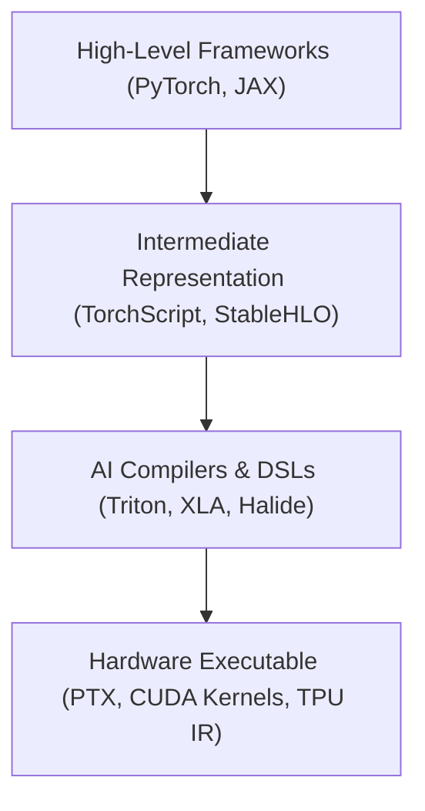

# LLM Inference Acceleration & Domain-Specific Languages (DSLs) in AI

## 1. LLM Inference Speedup: Speculative Decoding vs. Multi-Token Prediction

Decoder-only Large Language Models (LLMs) suffer from memory-bandwidth bottlenecks during auto-regressive generation because each token generation step requires loading all model weights from HBM/VRAM to compute logic (low Arithmetic Intensity).

### 1.1 Speculative Decoding
- **Mechanism:** Employs a small, fast **Draft Model** alongside a large **Target Model**.
  1. The small draft model speculatively generates a sequence of $K$ candidate tokens auto-regressively at high speed.
  2. The target model executes a single parallel forward pass over all $K$ candidate tokens simultaneously (evaluating candidate probabilities).
  3. A rejection sampling scheme validates tokens: accepts valid candidate tokens up to the first mismatched token.
- **Speedup Driver:** Reduces memory access passes over target model weights. Validating $K$ tokens in 1 target forward pass is drastically faster than $K$ separate target forward passes.
- **Trade-off:** Requires serving two distinct model weights (Draft + Target) in memory; acceptance rate depends on distribution alignment between draft and target models.

### 1.2 Multi-Token Prediction (MTP)
- **Mechanism:** Modifies the training objective of the LLM itself so the model natively predicts $N$ future tokens simultaneously at each position (using $N$ distinct output heads sharing the transformer backbone).
- **Speedup Driver:** Eliminates the need for a separate draft model. During inference, multiple tokens can be generated per forward pass directly, or used for fast self-speculative decoding without secondary weight overhead.
- **Trade-off:** Increases memory footprint during training and parameter count of the final projection layer; requires architectural modification during pretraining.

### Comparison Matrix

| Dimension | Speculative Decoding | Multi-Token Prediction (MTP) |
| --- | --- | --- |
| **Model Requirements** | Dual models (Draft Model + Target Model) | Single unified model with $N$ prediction heads |
| **Training Modification** | None (Post-hoc inference optimization) | Requires pretraining / fine-tuning with MTP loss |
| **Memory Footprint** | High VRAM usage for dual model weights | Slightly higher projection head parameters |
| **Acceptance / Yield** | Dynamic based on Draft-Target alignment | Deterministic multi-token head predictions |

---

## 2. Programming Languages (PLs) vs. Domain-Specific Languages (DSLs) in AI

Modern AI hardware stacks rely heavily on specialized Domain-Specific Languages (DSLs) and compilers to bridge high-level neural network operations down to hardware-specific execution units (Tensor Cores, Matrix Engines, Systolic Arrays).

### 2.1 General-Purpose Programming Languages (PLs)
- **Examples:** C++, Python, Rust.
- **Characteristics:** Expressive, general-purpose control flow, explicit memory management.
- **Limitation in AI:** Compilers (GCC, Clang) struggle to automatically optimize tensor abstractions, layout transformations, memory tiling, and parallel loop fusion across heterogeneous hardware architectures (GPUs, TPUs, NPUs).

### 2.2 Domain-Specific Languages (DSLs) & Compilers in AI
- **Examples:** OpenAI Triton, Halide, Google XLA, Mojo, CUDA C++ (low-level).
- **Characteristics:**
  - **Tiling & Layout Abstractions:** Explicitly decouple computation logic from memory indexing and hardware layout (e.g. block-level programming in Triton).
  - **Kernel Fusion:** Fuses point-wise operations (e.g. `MatMul + Bias + ReLU + LayerNorm`) into a single GPU kernel launch, keeping intermediate activations in SRAM/L1 cache to avoid VRAM round-trips.
  - **Hardware Specialization:** Translates tensor operations directly to target ISA intrinsics (e.g., NVIDIA PTX, WMMA, MMA instructions).

