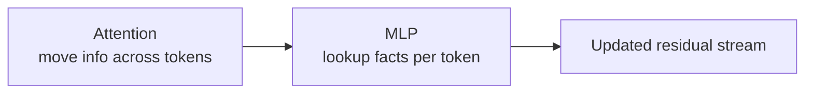
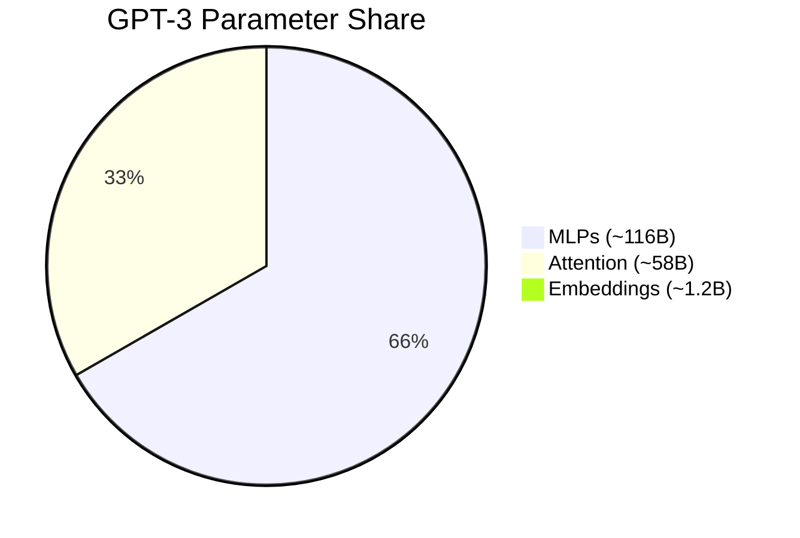
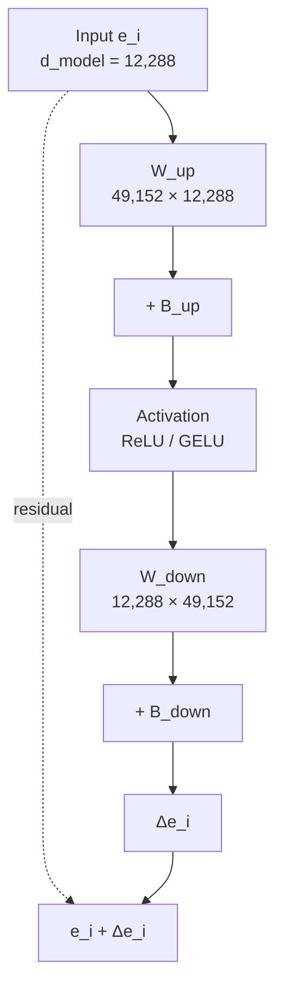
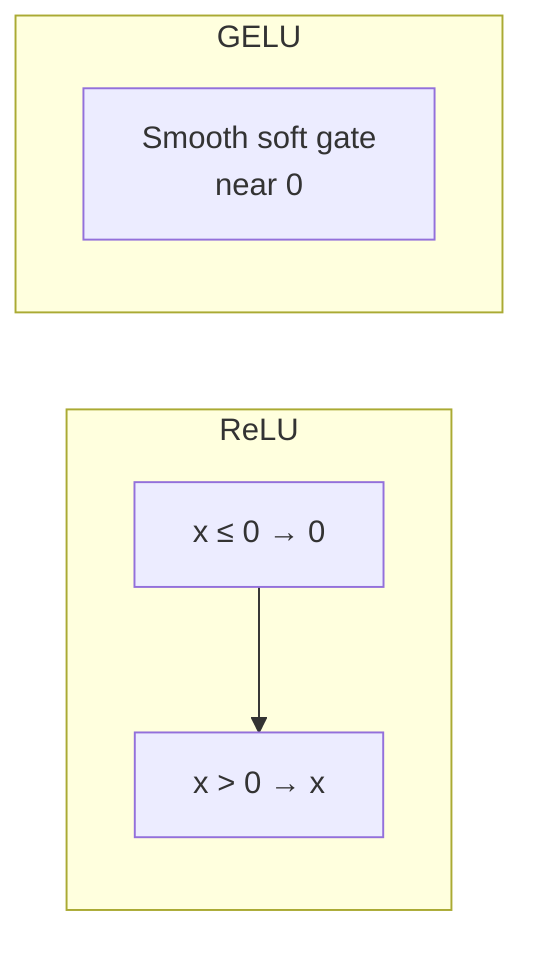
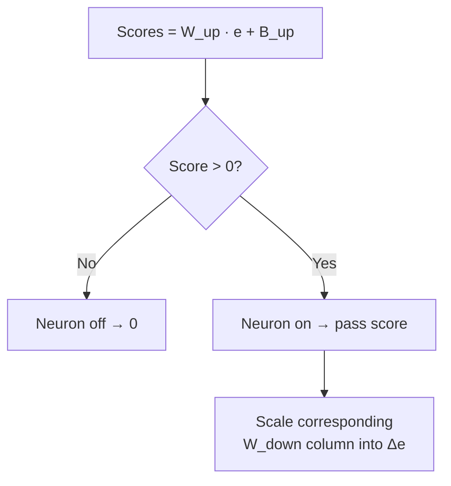
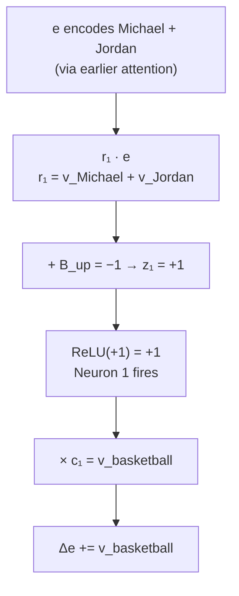
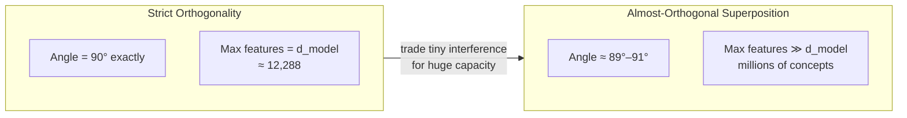
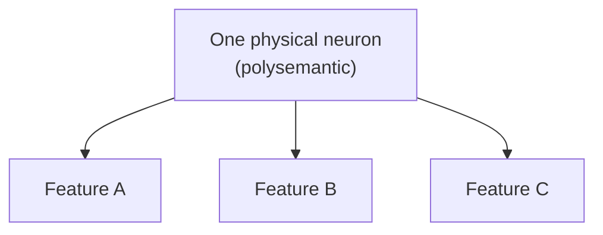
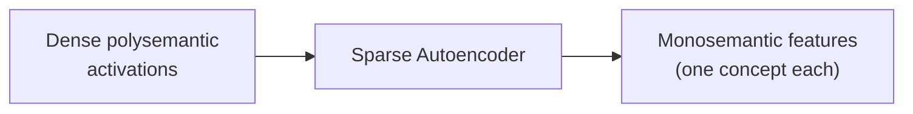

# Multi-Layer Perceptrons (MLPs) & Superposition

---

## 1. Role of MLPs in Transformers

While Attention mechanisms allow tokens to pass context back and forth across space, **Multi-Layer Perceptrons (MLPs)** process each token vector **independently and in parallel**.

* **Parameter Dominance**: MLPs account for approximately **two-thirds ($\approx 66\%$)** of all parameters in a transformer ($\approx 116\text{B}$ out of $175\text{B}$ in GPT-3).
* **Function**: MLPs act as **key-value associative memories** storing factual knowledge (e.g., mapping `"Michael Jordan"` $\to$ `"basketball"`, or `"Paris"` $\to$ `"Capital of France"`).

---

## 2. Architecture & Data Flow of an MLP Block

An MLP block consists of two linear transformations (matrix multiplications with bias) separated by a non-linear activation function.

### Mathematical Equation
$$\Delta e = W_{\text{down}} \cdot \text{Activation}\left( W_{\text{up}} e + B_{\text{up}} \right) + B_{\text{down}}$$

Where:
* $d_{\text{model}} = 12,288$
* $d_{\text{mlp}} = 4 \times d_{\text{model}} = 49,152$

---

## 3. Step-by-Step Computational Breakdown

### Step 1: Up-Projection ($W_{\text{up}}$) & Asking Questions
Thinking of $W_{\text{up}}$ row by row:
* Each row $r_j$ in $W_{\text{up}}$ acts as a question vector probing the input embedding $e$:
  $$\text{Score}_j = r_j \cdot e$$
* If $r_j$ aligns with a specific direction (e.g., $\vec{v}_{\text{Michael}} + \vec{v}_{\text{Jordan}}$), the dot product yields a high positive value when the input matches.

### Step 2: Bias ($B_{\text{up}}$) & Non-Linear Activation (ReLU / GELU)

> [!NOTE]
> The clean "$B_{\text{up}} = -1$, fires iff both conditions met" story below is a **pedagogical toy** (à la 3Blue1Brown) to build intuition for AND-gate behavior. Real networks learn messy, distributed thresholds — a single neuron rarely implements one crisp logical gate. Also, **GPT-3 specifically uses GELU**, not ReLU; ReLU is used here only because its hard cutoff makes the gate intuition clearer.

* **Bias Adjustment**: Setting $B_{\text{up}} = -1$ shifts the result so that the net value is positive **if and only if** both conditions are met ($\vec{v}_{\text{Michael}}$ AND $\vec{v}_{\text{Jordan}}$).
* **Rectified Linear Unit ($\text{ReLU}$)**:
  $$\text{ReLU}(x) = \max(0, x)$$

* **Neuron Behavior (AND Gate)**:
  * If $\text{Score} \le 0$: Neuron is **inactive** (clipped to 0).
  * If $\text{Score} > 0$: Neuron is **active** (fires output).

### Step 3: Down-Projection ($W_{\text{down}}$) & Adding Knowledge
Thinking of $W_{\text{down}}$ column by column:
* Each column $c_j$ in $W_{\text{down}}$ represents a directional payload vector in $d_{\text{model}}$ space (e.g., the $\vec{v}_{\text{basketball}}$ direction).
* If neuron $j$ is active ($>0$), column $c_j$ is scaled by the neuron's activation value and added to the output stream $\Delta e$.

---

## 4. Concrete Toy Example: Storing a Fact

**Goal**: Store the factual relation: `"Michael Jordan"` $\to$ `"basketball"`.

1. **Input State**: Vector $e$ arrives at position 2 encoding both `"Michael"` and `"Jordan"` (passed via earlier attention blocks).
2. **Up-Projection Row**: $r_1 = \vec{v}_{\text{Michael}} + \vec{v}_{\text{Jordan}}$.
3. **Dot Product + Bias**:
   $$z_1 = (r_1 \cdot e) + B_{\text{up}} = (1 + 1) - 1 = +1$$
4. **Activation**: $\text{ReLU}(+1) = +1$ (Neuron 1 fires!).
5. **Down-Projection Column**: $c_1 = \vec{v}_{\text{basketball}}$.
6. **Output**: $+1 \times \vec{v}_{\text{basketball}}$ is added into $\Delta e$, updating the output embedding vector to encode basketball.

---

## 5. Superposition & Sparse Autoencoders

### Why Superposition Exists
If each feature required a strictly orthogonal direction in a $d_{\text{model}}$-dimensional space, the model could store at most $d_{\text{model}}$ independent concepts (12,288 concepts in GPT-3).

### Almost-Orthogonal Vectors in High Dimensions
High-dimensional spaces can pack far more **almost-orthogonal** directions (e.g., angles between $89^\circ$ and $91^\circ$) than strictly orthogonal ones. The **Johnson–Lindenstrauss lemma** is the usual reference for this "lots of near-orthogonal vectors" geometry; the interpretability framing of *why models exploit it* comes from Anthropic's **Toy Models of Superposition** (2022).
* In 100 dimensions, optimizing for near-orthogonality allows fitting **thousands** of features with minimal interference noise.
* The capacity for storing almost-orthogonal concepts grows **exponentially** with the dimension count $d_{\text{model}}$.

### Polysemantic Neurons
Because models use superposition, individual physical neurons rarely correspond to single clean concepts (like "Michael Jordan"). Instead, single neurons respond to multiple unrelated concepts in superposition (**polysemanticity**).

### Sparse Autoencoders (SAEs)
Interpretability researchers (e.g., Anthropic, Google DeepMind) use **Sparse Autoencoders** to disentangle dense, polysemantic layer activations into a much larger set of sparse feature directions, many of which turn out to be interpretable / near-monosemantic. Not every recovered feature is cleanly monosemantic, and coverage is partial — this is an active, imperfect research area rather than a solved decomposition.

---

## 6. Parameter Scorecard for MLPs (GPT-3 Benchmark)

For GPT-3 ($d_{\text{model}} = 12,288$, $d_{\text{mlp}} = 49,152$, $L = 96$ layers):

### 1. Single Layer MLP Parameters
* $W_{\text{up}}$: $49,152 \times 12,288 \approx 603,979,776$
* $W_{\text{down}}$: $12,288 \times 49,152 \approx 603,979,776$
* Biases ($B_{\text{up}} + B_{\text{down}}$): $49,152 + 12,288 = 61,440$
* **Per Layer Subtotal**: $\approx \mathbf{1.208 \text{ Billion parameters}}$

### 2. Across All 96 Layers
* $96 \text{ Layers} \times 1.208\text{B} \approx \mathbf{116 \text{ Billion parameters}}$ ($\approx 66.3\%$ of GPT-3's total 175B parameters).
