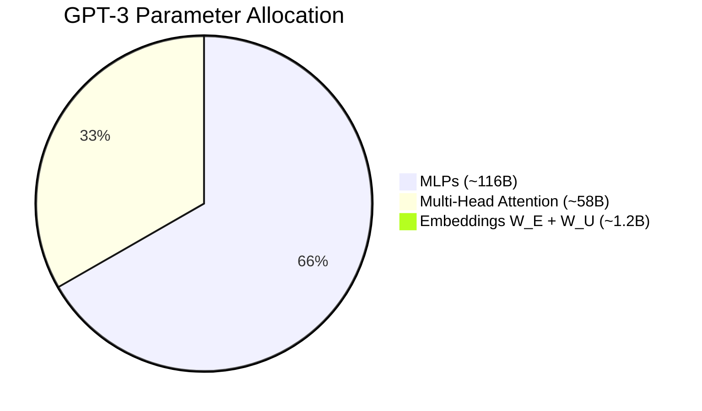

# Large Language Model (LLM) & Transformer Architecture Notes

Visual and technical study notes on LLM / Transformer internals, based on 3Blue1Brown's visual deep learning series.

---

## Table of Contents

| Chapter | Title | Key Topics |
| :--- | :--- | :--- |
| **[1. GPT & Transformer Overview](GPT_TransformerOverview.md)** | Autoregressive loop, embeddings, unembedding, Softmax / Temperature |
| **[2. Attention Mechanism](AttentionMechanism.md)** | Q/K/V, scaled dot-product, causal masking, multi-head & cross-attention, **KV cache & sparse/hybrid long-context tradeoffs** |
| **[3. MLPs & Superposition](MLP_Superposition.md)** | MLP as associative memory, activations, superposition, SAEs |
| **[4. Context Window & Billing Q&A](ContextWindow_BillingQA.md)** | Read vs write tokens, rate limits, stateless history, prompt caching |

Related notes in this folder: [RLHF / SFT / DPO](RLHF_SFT_DPO_Pipeline.md) · [LLM Inference & Compiler DSLs](LLMInference_CompilerDSL.md) · [Kimi K3](Notes%20on%20KIMIK3.md)

Interview-style depth on KV cache / GQA / sparse reduction: root [`Questions.md`](../Questions.md) Q5, Q12, Q21, Q22.

---

## GPT-3 Architecture Parameter Distribution (175 Billion Total)

### Detailed Breakdown

| Model Component | Parameter Count per Layer | Total Count (96 Layers) | Percentage of Network |
| :--- | :--- | :--- | :--- |
| **Token Embedding Matrix ($W_E$)** | Single Instance | $617,558,016$ | $0.35\%$ |
| **Token Unembedding Matrix ($W_U$)** | Single Instance | $617,558,016$ | $0.35\%$ |
| **Attention Blocks (96 Heads/Layer)** | $603,979,776$ | $57,982,058,496$ | $33.1\%$ |
| **MLP Blocks ($d_{\text{mlp}} = 49,152$)** | $1,207,959,552$ | $115,964,116,992$ | $66.26\%$ |
| **Grand Total** | | **$\approx 175,181,291,520$** | **$100.0\%$** |

> [!NOTE]
> This table follows the 3Blue1Brown convention of counting $W_E$ and $W_U$ as **separate** matrices. GPT-2/GPT-3 actually **tie** the input and output embeddings (the same matrix is reused), so a strict accounting counts these weights once. Positional embeddings, biases, and LayerNorm gains (small relative to 175B) are also omitted here.

---

## Key Formula Reference

1. **Softmax with Temperature**:
   $$P(x_i) = \frac{e^{z_i / T}}{\sum_{j} e^{z_j / T}}$$

2. **Scaled Dot-Product Self-Attention**:
   $$\text{Attention}(Q, K, V) = \text{softmax}\left( \frac{Q K^T}{\sqrt{d_k}} + M \right) V$$

3. **Multi-Layer Perceptron Vector Update**:
   $$\Delta e = W_{\text{down}} \cdot \text{ReLU}\left( W_{\text{up}} e + B_{\text{up}} \right) + B_{\text{down}}$$
