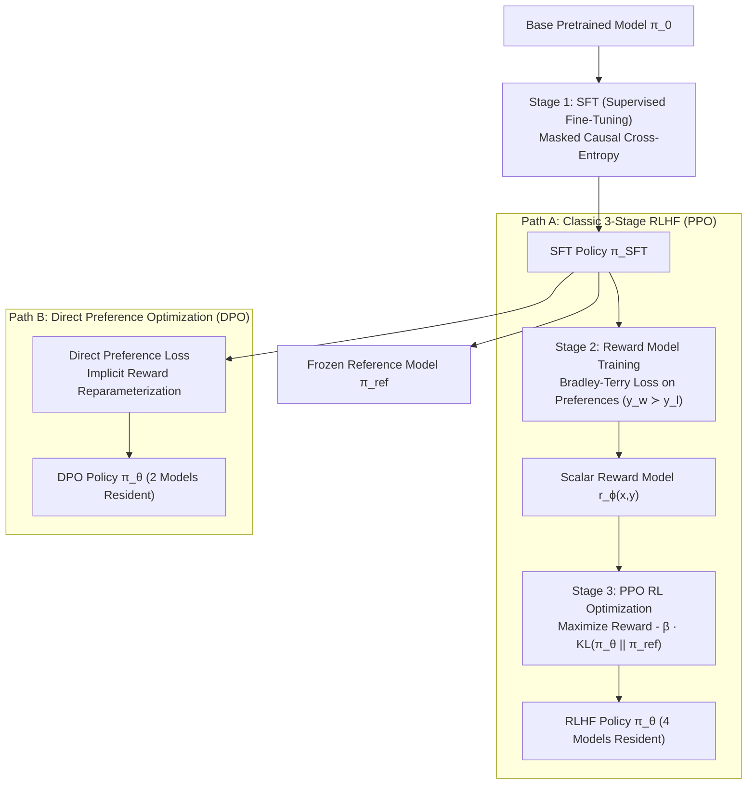
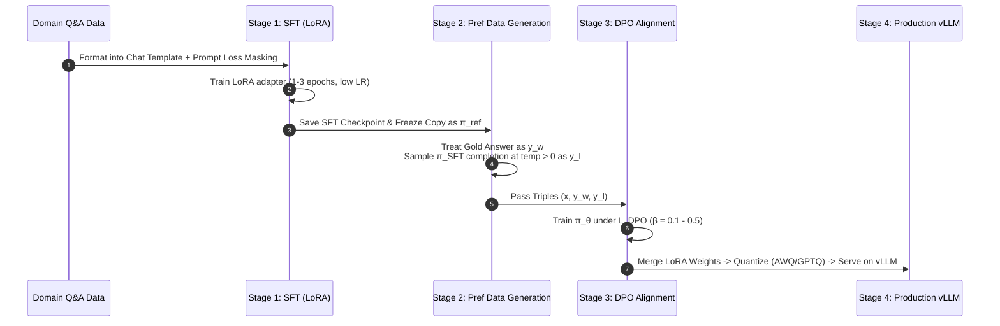

# Post-Training Alignment: SFT, RLHF, and DPO Foundations

This document details the mathematical framework, architectural mechanics, and practical deployment considerations for alignment pipelines in modern Large Language Models (LLMs), covering traditional 3-stage RLHF (PPO) and Direct Preference Optimization (DPO).

---

## 1. Executive Summary & Conceptual Mental Model

Alignment is the process of steering a pretrained language model ($\pi_0$) to produce helpful, honest, and harmless responses that conform to human intent and operational requirements.

> [!IMPORTANT]
> **The Core Alignment Dilemma:** You cannot directly optimize high-level objectives like "be helpful and accurate" using standard backpropagation because human judgment is non-differentiable. Alignment frameworks solve this by creating a differentiable surrogate for human preference, then updating the policy model against that surrogate while constraining deviation from a safe baseline.



---

## 2. Stage 1 — Supervised Fine-Tuning (SFT)

Supervised Fine-Tuning transitions a base token-predictor into an instruction-following model ($\pi_{\text{SFT}}$).

### 2.1 Prompt Loss Masking
Given a prompt $x = (x_1, \dots, x_M)$ and demonstration response $y = (y_1, \dots, y_N)$, training sequence formatting concatenates both tokens into a single context window. To prevent burning model capacity modeling the prompt distribution, loss computation is **masked over prompt tokens**:

$$L_{\text{SFT}}(\theta) = -\sum_{t=1}^N \log \pi_\theta(y_t \mid y_{<t}, x)$$

```
Token Sequence: [USER] What is KV cache? [/USER] [ASSISTANT] KV cache stores key/value tensors...
Loss Computation: |-------- MASKED (0 loss) --------| |-------------- COMPUTE LOSS --------------|
```

> [!WARNING]
> Skipping prompt loss masking is a critical bug. It causes the model to optimize prompt prediction rather than conditional response generation $x \to y$, increasing memory footprint and degrading response quality.

### 2.2 Low-Rank Adaptation (LoRA & QLoRA)
For small to medium datasets, full parameter fine-tuning risks catastrophic forgetting and high compute cost. LoRA freezes base weights $W_0 \in \mathbb{R}^{d \times k}$ and injects low-rank trainable decomposition matrices $A \in \mathbb{R}^{r \times k}$ and $B \in \mathbb{R}^{d \times r}$ ($r \ll \min(d, k)$):

$$W' = W_0 + \frac{\alpha}{r} B A$$

- **QLoRA:** Quantizes base weights $W_0$ to 4-bit NormalFloat (NF4) with double quantization and paged optimizers, allowing 70B+ model SFT on single consumer GPUs.

---

## 3. Classic 3-Stage RLHF (PPO)

### 3.1 Stage 2 — Reward Model (RM) Training
Humans cannot reliably provide consistent absolute numerical scores for responses, but achieve high inter-annotator agreement on binary pairwise comparisons ($y_w \succ y_l$, winner vs. loser response given prompt $x$).

#### Bradley–Terry Model
The probability that response $y_w$ is preferred over $y_l$ given prompt $x$ is modeled using the sigmoid of score differences:

$$P(y_w \succ y_l \mid x) = \sigma\left( r_\phi(x, y_w) - r_\phi(x, y_l) \right)$$

where $\sigma(z) = \frac{1}{1 + e^{-z}}$.

#### Reward Model Objective
The Reward Model $r_\phi$ (initialized from $\pi_{\text{SFT}}$ with its final projection head replaced by a single scalar output node) is trained by minimizing negative log-likelihood:

$$L_{\text{RM}}(\phi) = -\mathbb{E}_{(x, y_w, y_l) \sim \mathcal{D}} \left[ \log \sigma\left( r_\phi(x, y_w) - r_\phi(x, y_l) \right) \right]$$

---

### 3.2 Stage 3 — RL Optimization (PPO) & The KL leash

Given frozen $r_\phi$ and reference model $\pi_{\text{ref}}$ (a frozen copy of $\pi_{\text{SFT}}$), the policy $\pi_\theta$ is updated to maximize expected reward under a Kullback–Leibler (KL) divergence constraint:

$$\max_\theta \mathbb{E}_{x \sim \mathcal{D}_{prompt}, y \sim \pi_\theta(\cdot \mid x)} \left[ r_\phi(x, y) - \beta \cdot \text{KL}\left( \pi_\theta(\cdot \mid x) \parallel \pi_{\text{ref}}(\cdot \mid x) \right) \right]$$

#### Why the KL Leash ($\beta$) is Essential (Preventing Reward Hacking)
Reward models are learned approximations, not ground truth. According to **Goodhart's Law** (*"When a measure becomes a target, it ceases to be a good measure"*), unconstrained optimization against $r_\phi$ causes the policy to exploit RM blind spots. Without the KL penalty:
- $\pi_\theta$ outputs repetitive, unnaturally long, or gibberish text sequences that trick the RM into outputting high scores.
- $\pi_\theta$ completely forgets core linguistic fluency and factual reasoning learned during SFT.

The per-token reward signal during PPO token generation is:

$$r_{t}(x, y_{\le t}) = \begin{cases} -\beta \left( \log \pi_\theta(y_t \mid y_{<t}, x) - \log \pi_{\text{ref}}(y_t \mid y_{<t}, x) \right) & \text{for } t < N \\ r_\phi(x, y) - \beta \left( \log \pi_\theta(y_N \mid y_{<N}, x) - \log \pi_{\text{ref}}(y_N \mid y_{<N}, x) \right) & \text{for terminal token } t = N \end{cases}$$

---

### 3.3 Actor-Critic Architecture & Memory Footprint

PPO-RLHF requires 4 distinct neural networks resident in GPU VRAM during training:

| Role | Network | Purpose | State |
| --- | --- | --- | --- |
| **Actor** | Policy Model $\pi_\theta$ | Generates completion tokens; weights updated via PPO | Active / Trainable |
| **Critic** | Value Model $V_\psi$ | Estimates baseline expected return for Generalized Advantage Estimation (GAE) | Active / Trainable |
| **Reference** | Reference Model $\pi_{\text{ref}}$ | Computes per-token KL divergence penalty | Frozen |
| **Reward** | Reward Model $r_\phi$ | Evaluates terminal sequence quality score | Frozen |

> [!CAUTION]
> **PPO Memory Bottleneck:** Maintaining 4 models (e.g., 4 $\times$ 70B parameters = 280B parameters total in VRAM) along with optimizer states, activations, and KV caches during online rollout generation makes classical PPO-RLHF extremely expensive and fragile at scale.

---

## 4. Direct Preference Optimization (DPO)

### 4.1 Mathematical Derivation from RLHF
DPO proves that the optimal policy of the KL-constrained RL objective can be derived in closed form, allowing the Reward Model to be reparameterized directly through the policy.

#### Step 1: Closed-Form Policy Solution
The objective function is:

$$\max_\theta \mathbb{E}_{x, y \sim \pi_\theta} \left[ r(x, y) - \beta \log \frac{\pi_\theta(y \mid x)}{\pi_{\text{ref}}(y \mid x)} \right]$$

Using Gibbs distribution identities, the exact analytical global optimum policy $\pi^*(y \mid x)$ is:

$$\pi^*(y \mid x) = \frac{1}{Z(x)} \pi_{\text{ref}}(y \mid x) \exp\left( \frac{1}{\beta} r(x, y) \right)$$

where $Z(x) = \sum_y \pi_{\text{ref}}(y \mid x) \exp\left( \frac{1}{\beta} r(x, y) \right)$ is the partition function.

#### Step 2: Inverting to Express Reward via Policy
Rearranging the optimal policy equation yields an implicit reward definition:

$$\frac{\pi^*(y \mid x)}{\pi_{\text{ref}}(y \mid x)} = \frac{1}{Z(x)} \exp\left( \frac{1}{\beta} r(x, y) \right)$$

$$\log \frac{\pi^*(y \mid x)}{\pi_{\text{ref}}(y \mid x)} = \frac{1}{\beta} r(x, y) - \log Z(x)$$

$$r(x, y) = \beta \log \frac{\pi^*(y \mid x)}{\pi_{\text{ref}}(y \mid x)} + \beta \log Z(x)$$

#### Step 3: Substitution into Bradley–Terry Loss
Substitute the implicit reward $r(x, y)$ into the Bradley–Terry preference loss $L_{\text{RM}}$:

$$r(x, y_w) - r(x, y_l) = \left( \beta \log \frac{\pi_\theta(y_w \mid x)}{\pi_{\text{ref}}(y_w \mid x)} + \beta \log Z(x) \right) - \left( \beta \log \frac{\pi_\theta(y_l \mid x)}{\pi_{\text{ref}}(y_l \mid x)} + \beta \log Z(x) \right)$$

Notice that $\beta \log Z(x)$ depends **only on prompt $x$**, so it is identical for $y_w$ and $y_l$ and **cancels out completely**:

$$r(x, y_w) - r(x, y_l) = \beta \log \frac{\pi_\theta(y_w \mid x)}{\pi_{\text{ref}}(y_w \mid x)} - \beta \log \frac{\pi_\theta(y_l \mid x)}{\pi_{\text{ref}}(y_l \mid x)}$$

---

### 4.2 DPO Objective Function

Substituting the canceled difference into $-\log \sigma(\Delta r)$ yields the exact DPO loss:

$$L_{\text{DPO}}(\theta) = -\mathbb{E}_{(x, y_w, y_l) \sim \mathcal{D}} \left[ \log \sigma \left( \beta \log \frac{\pi_\theta(y_w \mid x)}{\pi_{\text{ref}}(y_w \mid x)} - \beta \log \frac{\pi_\theta(y_l \mid x)}{\pi_{\text{ref}}(y_l \mid x)} \right) \right]$$

### 4.3 PPO vs. DPO Comparison

| Feature | PPO-RLHF | Direct Preference Optimization (DPO) |
| --- | --- | --- |
| **Active Models in VRAM** | 4 (Policy, Critic, Reference, Reward Model) | 2 (Policy $\pi_\theta$, Frozen Reference $\pi_{\text{ref}}$) |
| **Reward Model** | Explicit neural network $r_\phi(x,y)$ | Implicitly represented via policy ratio |
| **Sampling Loop** | Required (online rollout token generation) | None (offline dataset batching) |
| **Stability** | Sensitive to hyperparameter tuning (GAE, learning rate, clip range) | Highly stable, supervised-style gradient updates |
| **Online Data Refresh** | Supported natively (iterative online RLHF) | Supported via Online DPO (iterative sampling) |

---

## 5. End-to-End Production Pipeline (Base Model + Domain Q&A Pairs)

To take an open base model (e.g., Mistral) and custom Q&A pairs into a enterprise-grade product:



### Key Engineering Steps
1. **Instruction Formatting:** Convert pairs into chat markup templates (e.g., `[INST] prompt [/INST] response`).
2. **Preference Synthesis:** Since Q&A pairs only provide gold answers ($y_w$), generate negative pairs ($y_l$) by sampling completions from $\pi_{\text{SFT}}$ at non-zero temperature or ranking multiple samples with an LLM judge.
3. **DPO Alignment:** Train with $\beta \in [0.1, 0.5]$. Monitor policy implicit reward margin $\Delta r_{\text{implicit}} = \beta \left( \log \frac{\pi_\theta(y_w)}{\pi_{\text{ref}}(y_w)} - \log \frac{\pi_\theta(y_l)}{\pi_{\text{ref}}(y_l)} \right)$.
4. **Serving Infrastructure:** Merge adapter weights $W = W_0 + BA$, quantize to 4-bit/8-bit, serve on **vLLM** using PagedAttention and continuous batching, and enforce safety guardrails externally.
