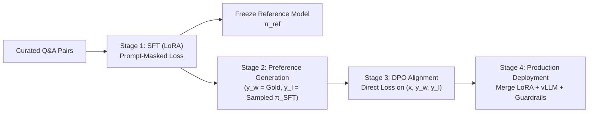
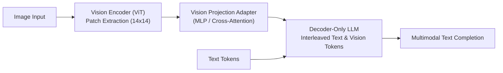

# Questions & Answers

## 1. What is Quantization, how does it work, and why is it unique?

**Answer:**
Quantization is a model compression technique that reduces the numerical precision of weights and activations (e.g., from 16-bit floating-point $\text{FP16}$ down to 8-bit $\text{INT8}$ or 4-bit $\text{INT4}$ integers) rather than deleting parameters.

- **How It Works:**
  - **Lower Precision:** Converts high-bit formats ($\text{FP16}/\text{BF16}$) to lower-bit formats ($\text{INT8}$, $\text{INT4}$, or sub-byte).
  - **Smaller Footprint:** Reduces memory (VRAM) requirements by $2\times$ to $4\times$ or more.
  - **Faster Speed:** Accelerates inference because transferring smaller data types through GPU/CPU memory bandwidth takes less time.

- **Why It Is Unique:**
  - Unlike **pruning** (which deletes weights) or **distillation** (which trains a smaller student model), quantization keeps the exact original network architecture intact.
  - It trades a tiny, often negligible amount of mathematical precision for massive hardware efficiency.

---

## 2. What is the difference between 4-bit (e.g., Q4_K_M) and 8-bit (e.g., Q8_0) quantization formats?

**Answer:**
- **8-bit Quantization ($\text{Q8\_0}$):**
  - **Precision:** High retention of original $\text{FP16}$ model capability and accuracy ($\sim 99\%$ of baseline).
  - **VRAM Savings:** $\sim 50\%$ reduction in VRAM compared to $\text{FP16}$.
  - **Use Case:** Best when VRAM is sufficient and zero loss in reasoning quality is required.

- **4-bit Quantization ($\text{Q4\_K\_M}$):**
  - **Precision:** Slight degradation in precision, but $k$-quant variants (like $\text{Q4\_K\_M}$ — medium mixture) strategically quantize critical layers at higher bits to preserve quality.
  - **VRAM Savings:** $\sim 75\%$ reduction in VRAM compared to $\text{FP16}$ (e.g., a $70\text{B}$ model fits into $\sim 40\text{ GB}$ VRAM instead of $140\text{ GB}$).
  - **Use Case:** Standard sweet spot for running larger models locally on consumer hardware.

---

## 3. What is Retrieval-Augmented Generation (RAG)?

**Answer:**
Retrieval-Augmented Generation (RAG) is an architecture pattern that enhances an LLM's output by retrieving relevant factual context from an external database or document repository before generating a response.

- **How It Works:**
  1. **Query & Retrieval:** When a user asks a question, the system searches a knowledge base (often using vector embeddings) to find relevant snippets/documents.
  2. **Prompt Augmentation:** The retrieved snippets are injected into the LLM's prompt context window alongside the user's original query.
  3. **Generation:** The LLM generates an accurate answer grounded directly in the provided reference materials.
- **Benefits:** Prevents hallucinations, allows access to private/up-to-date data, and eliminates the need for expensive model retraining or fine-tuning.

---

## 4. What is a Vector Database?

**Answer:**
A Vector Database is a specialized database designed to store, index, and query high-dimensional vector representations (embeddings) of data (text, images, audio, etc.).

- **How It Works:**
  - Text or media is converted into numerical vectors (dense arrays of floats) by an embedding model.
  - The vector database indexes these vectors to perform fast Approximate Nearest Neighbor (ANN) searches (e.g., using Cosine Similarity or Euclidean Distance).
- **Role in AI Systems:**
  - Serves as the core retrieval engine for **RAG** systems to perform semantic search (matching content by meaning rather than exact keywords).
  - Provides long-term memory for AI agents.

---

## 5. What is a KV Cache, how does it work, and why is it an inference bottleneck?

**Answer:**
A **KV (Key-Value) Cache** is a memory optimization technique used during autoregressive LLM decoding to store the Key ($K$) and Value ($V$) projection tensors calculated for all preceding tokens in a sequence.

- **How It Works:**
  - LLMs generate text token-by-token (autoregressively).
  - To produce each new token, the current Query token must attend to all previous tokens in the context window.
  - Instead of recomputing $K$ and $V$ tensors for past tokens at every generation step (which would require $O(N^2)$ redundant matrix multiplications), the model computes $K$ and $V$ once for each token and caches them in GPU memory (HBM).
  - On step $N+1$, the model only computes $K_{N+1}$ and $V_{N+1}$ and appends them to the cache.

- **Why It Becomes an Inference Bottleneck:**
  1. **VRAM Memory Footprint:** The size of the KV cache grows linearly with context length ($\text{len\_ctx}$) and batch size ($B$). At long contexts (e.g., $100\text{k}+$ tokens), the KV cache size can surpass the memory needed to store the model weights themselves.
  2. **Memory Bandwidth (HBM) Limit:** On every single decode step, the GPU must fetch the entire accumulated KV cache from HBM. As context grows, loading the KV cache turns the system from compute-bound to memory-bandwidth-bound, imposing a speed ceiling and causing price tier jumps (e.g., Gemini's $+200\text{k}$ context pricing kink).

---

## 6. What is the 3-Stage RLHF Pipeline (SFT, Reward Model, PPO), what is the math behind it, and why is the KL penalty critical?

**Answer:**
**Reinforcement Learning from Human Feedback (RLHF)** is a post-training alignment pipeline composed of three distinct stages. Reinforcement learning only occurs in the third stage.

- **Mental Model:** You cannot directly optimize high-level human concepts like "helpfulness" or "harmlessness" with standard gradient descent because there is no differentiable loss for human preference. RLHF solves this by training a differentiable proxy (Reward Model) for human judgment, then using RL to optimize the language model against that proxy while enforcing a "KL leash" to prevent model degradation.

### Stage 1 — Supervised Fine-Tuning (SFT)
- **Objective:** Fine-tune a pretrained base model ($\pi_0$) on high-quality, human-written (prompt $x$, response $y$) demonstration pairs using standard causal cross-entropy loss:

$$L_{\text{SFT}}(\theta) = -\sum_{t \in \text{response}} \log \pi_\theta(y_t \mid y_{<t}, x)$$

- **Prompt Loss Masking:** Loss is masked over prompt tokens $x$ so the model learns the conditional mapping $x \to y$ rather than modeling the question distribution.
- **LoRA / QLoRA:** Parameter-efficient fine-tuning (PEFT) freezes base weights $W$ and learns a low-rank adapter $\Delta W = BA$ ($r \ll d$).
- **Role:** Produces $\pi_{\text{SFT}}$, providing basic instruction compliance and tone. Raw RL from a base model fails due to sparse rewards in a massive token action space. A copy of $\pi_{\text{SFT}}$ is frozen to serve as the reference model ($\pi_{\text{ref}}$) in Stage 3.

### Stage 2 — Reward Model (RM) Training
- **Pairwise Preferences:** Humans struggle to assign absolute numerical scores to responses consistently, but excel at binary comparisons ($y_w \succ y_l$). For prompt $x$, multiple completions are generated from $\pi_{\text{SFT}}$ and ranked by human evaluators into preference pairs $(x, y_w, y_l)$.
- **Bradley–Terry Preference Model:** The RM $r_\phi(x, y)$ (typically $\pi_{\text{SFT}}$ with its token prediction head replaced by a single scalar output head) is trained under the Bradley–Terry framework:

$$P(y_w \succ y_l \mid x) = \sigma\left( r_\phi(x, y_w) - r_\phi(x, y_l) \right)$$

- **Loss Function:** Negative log-likelihood pushing winner score above loser score:

$$L_{\text{RM}}(\phi) = -\mathbb{E}_{(x, y_w, y_l)} \left[ \log \sigma \left( r_\phi(x, y_w) - r_\phi(x, y_l) \right) \right]$$

### Stage 3 — RL against Reward Model (PPO)
- **Objective:** Optimize policy $\pi_\theta$ (initialized from $\pi_{\text{SFT}}$) to maximize scores from frozen $r_\phi$ while penalizing deviation from frozen $\pi_{\text{ref}}$:

$$\max_\theta \mathbb{E}_{x, y \sim \pi_\theta} \left[ r_\phi(x, y) - \beta \cdot \text{KL}(\pi_\theta(\cdot \mid x) \parallel \pi_{\text{ref}}(\cdot \mid x)) \right]$$

- **Why the KL Penalty is Critical (Preventing Reward Hacking):** Reward models are imperfect proxies (Goodhart’s Law). Unconstrained optimization causes policy drift into out-of-distribution regions where the RM assigns artificially high scores to gibberish or repetitive text. The KL leash $\beta$ keeps $\pi_\theta$ within the trusted domain of $\pi_{\text{ref}}$.
- **Actor-Critic Setup & Memory Footprint:** Modeled as a contextual bandit / MDP (prompt = state, token = action, sequence RM score + per-token KL penalty $-\beta(\log \pi_\theta - \log \pi_{\text{ref}})$ = reward). Requires keeping **4 models in memory** simultaneously: Policy ($\pi_\theta$), Critic ($V_\phi$), Frozen Reference ($\pi_{\text{ref}}$), and Reward Model ($r_\phi$).

---

## 7. What is Direct Preference Optimization (DPO), how is its loss derived from RLHF, and why does it eliminate PPO?

**Answer:**
**Direct Preference Optimization (DPO)** reformulates the KL-regularized reward maximization problem to skip training a separate Reward Model and running an online RL sampling loop entirely.

### 1. Mathematical Derivation
The closed-form optimal policy $\pi^*(y \mid x)$ for Stage 3’s KL-constrained RL objective is:

$$\pi^*(y \mid x) = \frac{1}{Z(x)} \pi_{\text{ref}}(y \mid x) \exp\left(\frac{1}{\beta} r(x, y)\right)$$

where $Z(x) = \sum_y \pi_{\text{ref}}(y \mid x) \exp\left(\frac{1}{\beta} r(x, y)\right)$ is the partition function.

Inverting this equation re-expresses the reward function strictly in terms of policy probabilities:

$$r(x, y) = \beta \log \frac{\pi^*(y \mid x)}{\pi_{\text{ref}}(y \mid x)} + \beta \log Z(x)$$

Substituting this implicit reward expression into the Bradley–Terry loss ($L_{\text{RM}}$) yields:

$$r(x, y_w) - r(x, y_l) = \beta \log \frac{\pi_\theta(y_w \mid x)}{\pi_{\text{ref}}(y_w \mid x)} - \beta \log \frac{\pi_\theta(y_l \mid x)}{\pi_{\text{ref}}(y_l \mid x)}$$

*(The partition function $\beta \log Z(x)$ depends only on prompt $x$, making it identical for $y_w$ and $y_l$, so it cancels out completely!)*

### 2. DPO Loss Function

$$L_{\text{DPO}}(\theta) = -\mathbb{E}_{(x, y_w, y_l)} \left[ \log \sigma \left( \beta \log \frac{\pi_\theta(y_w \mid x)}{\pi_{\text{ref}}(y_w \mid x)} - \beta \log \frac{\pi_\theta(y_l \mid x)}{\pi_{\text{ref}}(y_l \mid x)} \right) \right]$$

### 3. Key Advantages over PPO
1. **Memory Efficiency:** Eliminates the Critic and Reward Model networks, reducing GPU VRAM residency from 4 models down to 2 ($\pi_\theta$ and frozen $\pi_{\text{ref}}$).
2. **Training Stability:** Replaces volatile RL policy gradients (GAE, PPO clipping, actor-critic dynamics) with a stable, supervised classification-like loss.
3. **No Generation Loop:** Trains directly on offline preference datasets without sampling completions during training.

---

## 8. How do you take an open base LLM (e.g., Mistral) and a dataset of Q&A pairs through an SFT-to-RLHF/DPO production pipeline?

**Answer:**
Transitioning an open base model and curated domain Q&A pairs into a production-ready assistant follows a 4-step pipeline:



### Step 1 — Supervised Fine-Tuning (SFT)
- Format Q&A pairs into the model's native Chat Template (e.g., Mistral `[INST] ... [/INST]`).
- Apply **prompt loss masking** so cross-entropy loss is computed only over response tokens ($y$).
- Train via LoRA/QLoRA ($r=16/32$, low learning rate, 1–3 epochs) to prevent catastrophic forgetting.
- Freeze a copy of the resulting checkpoint to serve as $\pi_{\text{ref}}$.

### Step 2 — Preference Dataset Manufacturing
- Single Q&A pairs provide demonstrations ($x, y$), not preference comparisons.
- **Cheapest Synthesis:** Treat the curated gold answer as chosen ($y_w$), and sample a completion from $\pi_{\text{SFT}}$ at temperature $> 0$ as rejected ($y_l$).
- **Rich-Judge Synthesis (RLAIF):** Sample $K$ completions from $\pi_{\text{SFT}}$ and rank them using a frontier model judge or domain heuristic to create $(x, y_w, y_l)$ triples.

### Step 3 — Preference Alignment via DPO
- Train the active policy $\pi_\theta$ using $L_{\text{DPO}}$ against frozen $\pi_{\text{ref}}$.
- Hyperparameter $\beta \in [0.1, 0.5]$ controls the KL leash strength. DPO increases the implicit reward of $y_w$ relative to $y_l$ while preventing policy drift.

### Step 4 — Serving & Productionization
- **Weight Merging:** Merge LoRA adapter weights back into the base model weights ($W_{\text{final}} = W_{\text{base}} + BA$).
- **Quantization:** Quantize to AWQ / GPTQ / GGUF (INT4/INT8) based on latency vs VRAM target.
- **Inference Engine:** Deploy on **vLLM** using PagedAttention and continuous batching.
- **Safety Layer:** Place external safety/refusal guardrails outside model weights as an input/output filter layer.

---

## 9. How does PagedAttention eliminate VRAM memory fragmentation in LLM inference servers (like vLLM)?

**Answer:**
Traditional LLM inference engines allocate contiguous memory chunks for each request's KV Cache based on its maximum potential context length. Because sequence lengths are dynamic and unpredictable:
- **Internal Memory Fragmentation:** Allocated memory blocks remain underutilized when actual generated sequences are shorter than max context limits (wasting up to $60\% - 80\%$ of VRAM).
- **External Memory Fragmentation:** Dynamically sized contiguous allocations leave unallocated gaps that cannot be repurposed for new requests.

**PagedAttention Solution:**
Inspired by virtual memory paging in traditional operating systems:
1. **Virtual Block Mapping:** PagedAttention divides the KV Cache of each sequence into fixed-size physical memory blocks (pages, e.g., 16 or 32 tokens per block).
2. **Non-Contiguous GPU Allocation:** Physical blocks are allocated non-contiguously in GPU VRAM and managed via a dynamic Block Table.
3. **Flexible Context Expansion:** As new tokens are generated autoregressively, new physical memory pages are allocated on demand from a shared memory pool.
4. **Memory Savings & Parallel Sampling:** Reduces VRAM fragmentation to under $<4\%$, enabling dramatically higher batch sizes and throughput (up to $2\times - 4\times$ throughput scaling).

---

## 10. What is the difference between Structural Guardrails and SFT/DPO-based Refusal Training in AI systems?

**Answer:**
Safety and refusal mechanisms in production LLM deployments are implemented across two distinct architectural layers:

1. **SFT / DPO-Based Refusal Training (Parametric / Intrinsic Alignment):**
   - **How It Works:** Taught directly during post-training fine-tuning (SFT/DPO) by including harmful prompt inputs paired with polite refusal responses.
   - **Pros:** Model natively refuses toxic or unsafe queries within generated output.
   - **Cons:** Subject to jailbreaks, prompt injection vulnerabilities, and catastrophic forgetting. Parametric refusals can also lead to over-refusal tax (refusing benign queries out of excessive caution).

2. **Structural Guardrail Layer (Extrinsic / System-Level Filtering):**
   - **How It Works:** Sits outside the model weights as an API gateway or wrapper (e.g., Llama Guard, NeMo Guardrails, regex blocklists, safety classifiers).
   - **Execution Flow:** Inspects input prompts before sending to the LLM (pre-execution filtering) and validates output completions before returning to the user (post-execution filtering).
   - **Pros:** Deterministic, easily updated without retraining model parameters, and provides air-gapped security enforcement.

---

## 11. What is Speculative Decoding, how does it accelerate LLM generation, and why is it mathematically lossless?

**Answer:**
**Speculative Decoding** is an inference acceleration technique that speeds up autoregressive token generation without changing the model's output distribution.

- **The Problem:** Autoregressive decoding is memory-bandwidth-bound on GPUs. Generating $K$ tokens requires $K$ sequential forward passes through a large target model $\mathcal{M}_{\text{target}}$, where each token launch incurs high memory access overhead.
- **How Speculative Decoding Works:**
  1. **Draft Generation:** A much smaller, faster draft model $\mathcal{M}_{\text{draft}}$ autoregressively generates a speculative sequence of $K$ candidate tokens ($\hat{x}_1, \dots, \hat{x}_K$).
  2. **Parallel Target Verification:** The target model $\mathcal{M}_{\text{target}}$ runs a **single parallel forward pass** over all $K$ candidate tokens simultaneously to compute its exact target probabilities $p(x_i \mid x_{<i})$.
  3. **Modified Rejection Sampling:** The candidate tokens are accepted or rejected based on a modified rejection sampling criteria:

$$\text{Acceptance Probability} = \min\left(1, \frac{p(\hat{x}_i \mid x_{<i})}{q(\hat{x}_i \mid x_{<i})}\right)$$

     where $q$ is the probability assigned by the draft model and $p$ is the probability assigned by the target model.
- **Why It Is Lossless:** The rejection sampling formula mathematically guarantees that the final output probability distribution over tokens matches $\mathcal{M}_{\text{target}}$ exactly ($100\%$ provably identical outputs).
- **Speedup:** Achieves $2\times - 3\times$ latency reduction because evaluating $K$ tokens in a single batch pass on the target model takes nearly the same time as generating 1 token.

---

## 12. What is Grouped-Query Attention (GQA), and how does it optimize the KV Cache bottleneck compared to Multi-Head (MHA) and Multi-Query (MQA) Attention?

**Answer:**
Multi-Head Attention (MHA) is a memory bandwidth bottleneck during inference decoding because every Query head requires its own distinct Key ($K$) and Value ($V$) head to be fetched from GPU memory (HBM) at every token step.

```
MHA (Multi-Head Attention):        GQA (Grouped-Query Attention):     MQA (Multi-Query Attention):
Q Q Q Q Q Q Q Q (8 Query heads)   Q Q  Q Q  Q Q  Q Q (8 Query heads)  Q Q Q Q Q Q Q Q (8 Query heads)
│ │ │ │ │ │ │ │                    └─┬─┘  └─┬─┘  └─┬─┘  └─┬─┘         └───┬───┬───┬───┬───┬───┘
K K K K K K K K (8 KV heads)       K      K      K      K (4 KV heads)     K               (1 KV head)
V V V V V V V V (8 KV heads)       V      V      V      V (4 KV heads)     V               (1 KV head)
```

### Architectural Breakdown
1. **Multi-Head Attention (MHA):**
   - $H$ Query heads, $H$ Key/Value heads ($1:1$ ratio).
   - **Pros:** Highest modeling quality and expressive capacity.
   - **Cons:** KV Cache memory footprint scales with $H$. High HBM memory bandwidth consumption during decoding.

2. **Multi-Query Attention (MQA):**
   - $H$ Query heads share **1 single Key/Value head** ($H:1$ ratio).
   - **Pros:** Reduces KV Cache memory footprint by $H\times$ (e.g., $8\times - 64\times$ savings), drastically speeding up decode throughput.
   - **Cons:** Quality degradation due to severe loss of KV representation capacity.

3. **Grouped-Query Attention (GQA):**
   - $H$ Query heads are divided into $G$ groups, where each group of Query heads shares **1 Key/Value head** ($1 < G < H$).
   - **Sweet Spot:** Delivers nearly the full quality and accuracy of MHA while providing $4\times - 8\times$ reduction in KV Cache memory size and bandwidth load (used in Mistral, Llama 2/3, and Phoenix models).

---

## 13. When is Supervised Fine-Tuning (SFT) sufficient on its own, and when does a project actually require RLHF/DPO?

**Answer:**
- **When SFT is Sufficient:** For domain-specific task adaptation (e.g., internal document Q&A, SQL generation, schema translation) where high-quality demonstration pairs $(x, y)$ exist. SFT effectively teaches sequence structure, terminology, and conditional mapping $x \to y$.
- **When RLHF/DPO is Required:** SFT struggles when the goal is to optimize subtle qualities that static demonstrations cannot easily convey—such as calibrated safety refusals, tone/style consistency, conciseness, or selecting the single most helpful response among multiple plausible options. Preference optimization (RLHF/DPO) allows the model to learn fine-grained trade-offs from comparative data.

---

## 14. What is the difference between Offline DPO and Online (Iterative) DPO?

**Answer:**
- **Offline DPO:** The policy $\pi_\theta$ is trained on a static, pre-collected dataset of preference triples $(x, y_w, y_l)$.
  - *Pros:* Simple, fast, and requires no online generation/rollout sampling loop during training.
  - *Cons:* As the policy $\pi_\theta$ updates, its output distribution drifts away from the initial dataset distribution. The implicit reward model built into $\pi_\theta$ becomes out-of-distribution (OOD) on new samples.
- **Online (Iterative) DPO:** The training process periodically pauses to sample new completions from the *current* policy $\pi_\theta$, ranks them using a reward model or LLM judge (RLAIF) to manufacture fresh preference pairs $(x, y_w, y_l)$, and resumes training.
  - *Pros:* Prevents distribution shift and reward staleness, achieving performance closer to online PPO-RLHF.

---

## 15. What is Reward Model Staleness in RLHF, and how does it trigger Reward Hacking?

**Answer:**
- **Reward Model Staleness:** In static 3-stage RLHF, the Reward Model $r_\phi$ is trained once on preference pairs generated by the initial $\pi_{\text{SFT}}$ model. As the active policy $\pi_\theta$ undergoes PPO reinforcement learning, its generated completions evolve significantly beyond what $\pi_{\text{SFT}}$ produced.
- **Reward Hacking (Goodhart's Law):** The frozen RM $r_\phi$ is forced to evaluate completions far outside its training distribution. $\pi_\theta$ discovers "adversarial gaps" or blind spots in $r_\phi$—such as appending specific formatting tricks or repetitive phrases—that yield unnaturally high scalar reward scores despite degrading actual human quality.
- **Mitigation:** Enforce a tight KL divergence penalty ($\beta$) against the reference model $\pi_{\text{ref}}$, or refresh preference data dynamically via online RLHF or online DPO.

---

## 16. Why is an independent Evaluation Benchmark Suite essential before shipping post-trained models?

**Answer:**
- **Preventing Silent Regressions:** LLM post-training (SFT, DPO, quantization) can easily optimize targeted domain prompts while quietly degrading general capabilities (catastrophic forgetting or over-refusal tax).
- **Static vs. Dynamic Evaluation:** Public benchmarks (e.g., MMLU, GSM8K) are vulnerable to data contamination. Production pipelines require dedicated, held-out localized benchmark suites (e.g., domain factual recall, instruction-following tests like IFEval, and unanswerable query abstention tests).
- **Gating Deployment:** A strict pass-rate threshold on the eval suite serves as the final automated gate before serving model weights via inference engines.

---

## 17. What is Continuous Batching (Iteration-Level Scheduling), and how does it differ from Traditional Request-Level Batching in LLM Serving?

**Answer:**
Autoregressive LLM generation processes requests token-by-token over two distinct computational phases:
1. **Prefill Phase:** Processes the entire input prompt in parallel (compute-bound, high GPU utilization).
2. **Decode Phase:** Generates tokens sequentially one-by-one (memory-bandwidth-bound, low GPU utilization).

### Traditional Request-Level Batching
- **The Problem:** Waits until **all** requests in a batch finish generating their complete output sequences before releasing the batch slots and accepting new incoming requests.
- **Efficiency Bottleneck:** If 1 request in a batch generates 1,000 tokens while 7 requests finish in 50 tokens, GPU compute sits idle for 950 decode steps waiting for the single slow request to complete.

### Continuous Batching (Iteration-Level Scheduling)
- **Mechanism:** Scheduling operates at the **individual iteration step** (token-level) rather than the sequence level.
- **Dynamic Slot Insertion:** The moment a request finishes generating its end-of-sequence (`[EOS]`) token, its slot is immediately freed, and a new request's prefill phase is inserted into the batch for the very next iteration step.
- **Result:** Eliminates GPU idle time, dramatically improving GPU throughput ($2\times - 4\times$) and serving efficiency.

---

## 18. What is Knowledge Distillation in SFT, and how is the combined Loss Function ($\alpha$-weighted) computed between Teacher and Student models?

**Answer:**
**Knowledge Distillation** transfers reasoning capability and distribution alignment from a larger, more capable Teacher model (e.g., Mistral Large / 70B+) into a smaller Student policy model $\pi_\theta$ (e.g., 7B/8B).

### Combined Loss Formulation
During Supervised Fine-Tuning, the Student model $\pi_\theta$ is optimized using a weighted combination of hard target ground-truth cross-entropy loss ($L_{\text{CE}}$) and soft-label Kullback–Leibler divergence loss ($L_{\text{KL}}$) against teacher probability distributions $\pi_{\text{teacher}}$:

$$L_{\text{distill}}(\theta) = (1 - \alpha) L_{\text{CE}}(y, \pi_\theta(x)) + \alpha \cdot T^2 \cdot \text{KL}\left( \pi_{\text{teacher}}\left(\frac{x}{T}\right) \parallel \pi_\theta\left(\frac{x}{T}\right) \right)$$

- **Hard Target Loss ($L_{\text{CE}}$):** Standard cross-entropy forcing the student to predict the exact ground-truth token.
- **Soft Target Loss ($L_{\text{KL}}$):** Compares the full logit distribution of student vs. teacher, allowing the student to learn dark knowledge (relative likelihoods of incorrect tokens).
- **Temperature ($T$):** Softens probability distributions to expose fine-grained logit structures.
- **Weight ($\alpha$):** Balances direct supervised learning vs. teacher distribution matching.

---

## 19. What is the difference between AWQ, GPTQ, and GGUF quantization techniques for LLM inference?

**Answer:**
- **GPTQ (Generalized Post-Training Quantization):**
  - *Method:* Layer-by-layer second-order matrix optimization (Hessian matrix inversion) to minimize output reconstruction error.
  - *Hardware Target:* Optimized for server GPUs (NVIDIA CUDA / Tensor Cores) in 4-bit/8-bit precision.
- **AWQ (Activation-aware Weight Quantization):**
  - *Method:* Protects the top $1\%$ salient weight channels (identified by observing activation magnitudes during a calibration pass) by keeping them at higher precision or scaling them up before quantization.
  - *Pros:* Outperforms GPTQ in preserving reasoning capabilities at low bit-widths (3-bit / 4-bit) with minimal overhead. Highly efficient on vLLM and TensorRT-LLM.
- **GGUF (GPT-Generated Unified Format / llama.cpp):**
  - *Method:* Multi-file container format supporting $k$-quants (`Q4_K_M`, `Q5_K_S`, etc.) that quantizes different transformer layers at varying precision levels based on sensitivity.
  - *Hardware Target:* Optimized for CPU inference, Apple Silicon (Metal), and hybrid CPU/GPU offloading (`llama.cpp`).

---

## 20. How are Vision-Language Models (VLMs) constructed by combining a Vision Transformer (ViT) with a Decoder-Only LLM?

**Answer:**
A multimodal Vision-Language Model (VLM, e.g., Pixtral, LLaVA, Phoenix-VL) integrates visual understanding into a text decoder via a 3-component pipeline:



1. **Vision Encoder (ViT):** Divides input images into fixed patches (e.g., $14 \times 14$ pixels), projects them into patch embeddings, and extracts dense visual representations.
2. **Vision Projection Adapter:** An MLP or cross-attention projection layer maps visual embeddings into the exact hidden dimension space of the language backbone. Special tokens (e.g., `[IMG]`, `[IMG_BREAK]`, `[IMG_END]`) delineate image boundaries.
3. **Language Backbone:** The LLM treats projected vision tokens identically to text token embeddings, attending across visual and textual contexts via standard self-attention to generate multimodal responses autoregressively.
